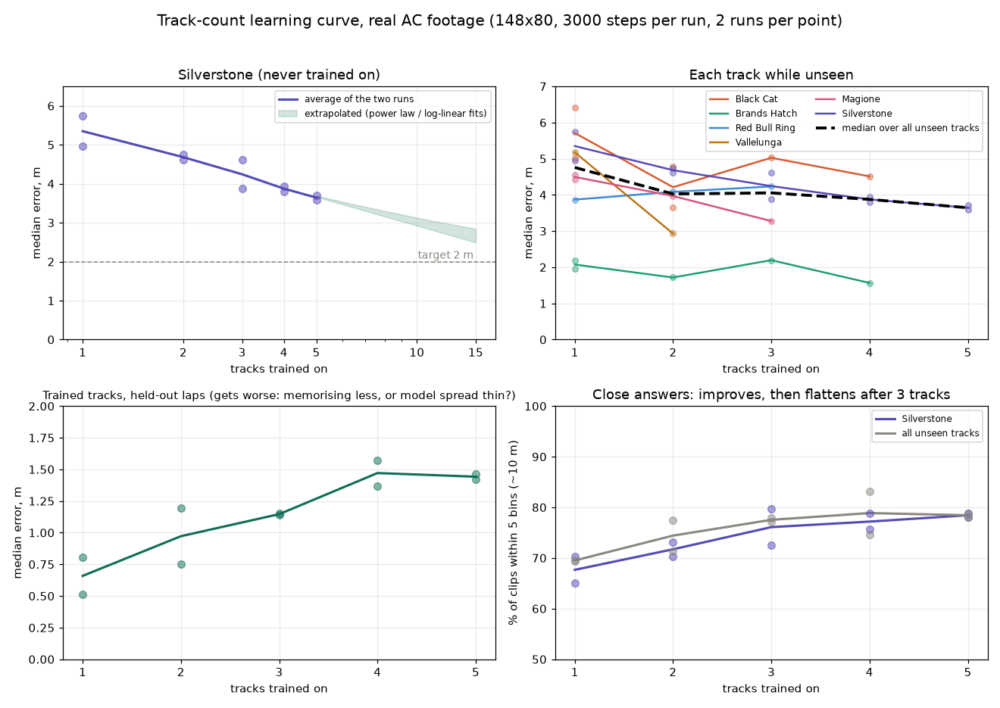
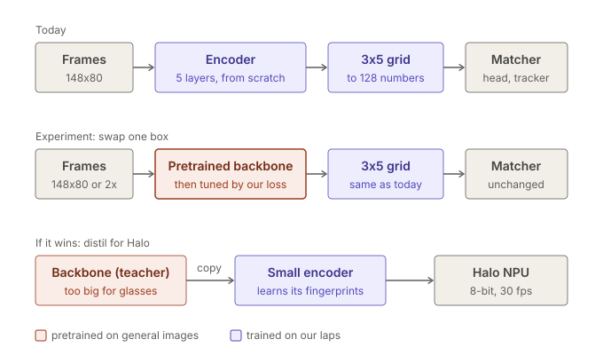

# PRIMAL design — progress estimation against a reference lap

> **Status: rewritten after the synthetic feasibility loop closed.** An earlier
> version of this document described a three-head network (Head R retrieval,
> Head A alignment, Head M ego-motion) on a 15–20M pretrained trunk at 256×256,
> reaching precision by distillation from a VGGT-class teacher. That design was
> never built. A 0.67M from-scratch encoder with a **single** head reached the
> precision target on synthetic data instead, so the three-head plan is closed
> and has been removed rather than archived — a dead architecture in a live
> document pollutes every decision made near it.
>
> Also closed, from the version before that: IMU-only descriptors, motif
> matching, and the `Feature` type in the `locamotif` crate. An IMU descriptor
> cannot resolve position along a straight.

---

## Where it stands (2026-09-30)

- **Data:** `packed_ac_v3`, Assetto Corsa at 148x80. 9 training circuits and 3
  unseen ones (Silverstone, Lime Rock, Oulton Park). Leakage and wrong-reference
  controls pass.
- **Product metric:** share of 15 Hz ticks whose delta is more than 100 ms off,
  on whole laps of the unseen tracks, camera only, runtime stride 2 (*Evaluation*).
- **Best camera-only result:** the pose + mirror recipe with head-turn
  re-renders, and the reference-time tracker (*Nine training circuits*, *The
  reference lap as the speed prior*), mean of three seeds:
  - unseen tracks: 13.9% of ticks over budget (12.4-15.5% across seeds);
  - same car: 7.8%, on 16 Silverstone pairs of near-identical bot laps;
  - median about 1.6 m / 43 ms; misses beyond 10 m around 0.2%;
  - with a true speed signal: 2.6%.
  - More circuits barely help at this model size (5 -> 9 circuits: 18.8% ->
    17.9%).
  - That tracker was tuned on bot laps, which repeat the reference's rhythm.
    For a driver whose pace wanders ±5% with a mistake a minute, the two-mode
    version reaches 22.8% (the single mode 32.4%). Measured pace is again
    worth having for real drivers.
- **What moved it this week:**
  - runtime stride 2 removed a ~60 ms lag;
  - tracking in reference time replaced most of a speed sensor;
  - augmentation with mirroring.
- **Strongest model so far, two seeds:** the same recipe with an ImageNet
  ResNet-18 encoder roughly halves every error (unseen 6.9-7.0% with the
  reference-time tracker, trained tracks 14.3-14.7%). It is ten times the 0.67M
  encoder and too big for Halo. Distilling it into the small encoder
  transferred nothing. A pretrained MobileNetV3-Small, which does fit Halo,
  comes close once its backbone trains at the full rate (unseen 7.6%, one seed);
  a MobileNetV3-Large cut to Halo's size did not beat it. Pretraining, not the
  architecture, is the source; fine-tuning on AC footage is what makes it work
  (*A pretrained backbone for the encoder*).
- **First real footage** (a GoPro of a solo kart session, never trained on):
  with pretrained encoders, ~55-60 ms median and 24-26% of ticks over budget,
  same session; the 0.67M encoder 37% (*First real footage*).
- **Hardware:** Halo can run it standalone. Vela puts it at 27-34% of the NPU
  once GroupNorm, the one layer the NPU cannot run, is removed (*Measured for
  Halo's NPU with Vela*).
- **Open:**
  - a retrain without GroupNorm;
  - speed from the camera on Halo, as a refinement;
  - a lap aligner, for voting and a self-improving reference;
  - an abstain signal;
  - tests on the glasses themselves.

---

## Goal

Given **one reference lap as context**, estimate progress `s` along it from a
live POV clip. Everything the product shows is a lookup on `s`:

| Output | Derivation |
|--------|------------|
| Time delta | `t_live − t_ref(s)` |
| Delta rate ("gaining / losing now") | `d/dt` of the above |
| Sector / corner attribution | integrate delta rate between fixed `s` bounds |
| Lateral line offset | not currently produced — see *Not built yet* |

No GNSS at runtime. GNSS/RTK is free at training and evaluation time; the
constraint is on the product, not the dataset.

---

## Precision budget

One number drives the design. A kart at 15 m/s covers 1 m in **67 ms**, so
"metre-level position" and "sub-100 ms delta" are the same requirement.

| Quantity | Karting value |
|----------|---------------|
| Speed range | 11–22 m/s (40–80 km/h) |
| Lap time | 45–60 s |
| Track length | 1.0–1.2 km |
| **Target delta error** | **≤ 100 ms (≈ 1.5 m)** |
| Target delta jitter | ≤ 50 ms std over a 1 s window |
| Live inference rate | 15 Hz |
| Runtime | on the glasses (Halo's Ethos-U55 NPU) or a phone; ~25 min session |

Published place-recognition benchmarks score "correct within 25 m." That is
~1.7 **seconds** of delta at kart speed. Retrieval models are trained to be
*invariant* to the distinction this product must *measure*. This remains the
single most important fact about the problem.

---

## Landscape

### What drivers use today

GPS lap timers are the comparison a driver will make. Their accuracy claims
mix best cases with specifications:

- The 25 Hz consumer GNSS modules this class of timer is built on are specified
  at **1.5 m CEP**: half of all fixes within 1.5 m (u-blox M10). Racelogic's
  VBOX Sport states **±2 m at 95%**. RaceBox advertises "precision as fine as
  10cm" and gives no accuracy figure in its technical specifications.
- **Phones are worse:** about 4.9 m typical under open sky (GPS.gov), usually at
  1 Hz, and smoothed or snapped for navigation. Fixes off the track and sudden
  jumps are normal on a phone.
- **Centimetres need RTK**: a base station sending live corrections.

A live delta needs consistency more than accuracy. Most GNSS error drifts over
tens of minutes, so two laps a few minutes apart share it. What remains is
jitter. Against a reference lap from another day, the whole drift remains, and
because it is a shift in space, its effect along the track changes sign with
the track's heading. Lap *times* cancel constant errors at the line and are far
better than any live delta.

Estimated, not measured — live delta error at kart speed (11-22 m/s):

| Situation | Along-track error | Delta error |
|---|---|---|
| Dedicated 25 Hz timer, open sky, reference from the same session | 0.2-0.5 m | ~10-45 ms |
| Dedicated timer near trees, grandstands, buildings | 0.5-2 m | ~25-180 ms |
| Dedicated timer, reference from another day | 1-3 m | ~45-270 ms, varying through the lap |
| Phone GPS | ~5 m, with jumps | several hundred ms |

Measured by Racelogic: aligning two laps at Silverstone National by distance
instead of position gave 0.3 s of error. Timers that predict from wheel speed or
distance drift like that through a lap.

Against the precision budget's 1.5 m, PRIMAL holds 1.6 m median on trained
tracks and 4.3 m on an unseen one (*Estimator*). Its millisecond figures are
measured at AC car speeds, faster than a kart, so metres are the fair
comparison. A video reference does not drift between days, the one row where
GPS is structurally weak.

Garmin Catalyst (about $1000, dash-mounted, for cars) combines a camera with
10-25 Hz GNSS and inertial sensors, marketed as "True Track Positioning". How
much the camera contributes to position is not published.

### Prior art for the matcher

The matcher is built from standard parts: a shared (Siamese) encoder and an
all-pairs similarity grid, as in SiamFC tracking and FlowNet/RAFT optical flow;
a map given as input rather than memorised, as in OrienterNet; and SeqSLAM's
sequence matching, which it beats on real footage by 9x on an unseen track and
29x on trained ones, and by 40-150x across a change of car and weather
(*Against a classical baseline*). The code and weights here are written and trained from
scratch. What is specific is the combination: progress against the driver's own
reference lap, time-spaced bins that read out as delta, no GNSS, a glasses
camera, and a phone. No literature or patent search has been done.

---

## Hardware target

### Decided

**The delta is shown on the glasses.** No phone mount: the phone is compute and
storage, the glasses are camera and display. Where the network runs is open:
on the phone, split between glasses and phone, or entirely on the glasses.

### What the network costs

Counted on `runs/ac2_time_allframes` (667 k parameters, 1.3 MB at fp16). Only
the newest frame is encoded each tick; the other clip frames are cached.

| Reference length | Encoder (per frame) | Head over all bins | Correlation | Per tick | At 15 Hz |
|---|---|---|---|---|---|
| Vallelunga, 860 bins | 34.7 M MACs | 73.8 M | 1.3 M | 110 M | 1.65 G MAC/s |
| Silverstone, 1300 bins | 34.7 M | 111.6 M | 2.0 M | 148 M | 2.22 G MAC/s |
| Black Cat, 3227 bins | 34.7 M | 277.0 M | 5.0 M | 317 M | 4.75 G MAC/s |

One tick takes 2.3 ms on a single Mac CPU core in fp32, against a 67 ms budget.
On a phone's neural engine (tens of TOPS) the arithmetic is negligible; the
power is waking the accelerator, estimated at tens of mW and not measured. The
head scans every bin, so it grows with track length; restricting it to a window
around the tracker's position would cut it if that ever matters.

The encoder accepts any resolution. Its cost at other inputs, as a share of
Halo's NPU at theoretical peak (Ethos-U55, 128 MACs per cycle at 160 MHz, 41
GOPS); Vela puts our encoder at 67-72% utilisation (below), so busy time is
about 1.5x these:

| Encoder input | M MACs/frame | 15 fps | 30 fps | 60 fps |
|---|---|---|---|---|
| 148x80 (today) | 34.7 | 3% | 5% | 10% |
| 160x120 (4:3) | 54.9 | 4% | 8% | 16% |
| 224x168 | 107.5 | 8% | 16% | 31% |
| 320x240 | 216.6 | 16% | 32% | 63% |
| 640x480 | 862.9 | 63% | 126% | 253% |

### Measured for Halo's NPU with Vela

`npu/` ports the trained model to int8 TensorFlow Lite and compiles it with Arm's
Vela 5.2 for Halo's Ethos-U55-128 at 160 MHz (`npu/vela.ini`):
- `python -m npu.export_weights` (training environment) dumps the weights,
  calibration frames and PyTorch's own outputs.
- `.venv-npu/bin/python npu/build_tflite.py` (TensorFlow and Vela) rebuilds the
  model, checks it, quantises it and compiles it.

The port is exact and 8-bit costs nothing measurable:
- **Encoder:** fp32 matches PyTorch to 2e-6; int8 embeddings keep 0.997 cosine
  similarity (worst 0.985) on held-out-track frames.
- **Head:** int8 moves the readout by 0.1 bins in median (p90 0.2-0.6), with
  the peak in the same place within one bin 95-100% of the time.

Vela per inference, from the `v3_recipe_s0` weights. Weights read from MRAM
cost the same time as from SRAM, with the MRAM timing assumed:

| | NPU time | NPU busy | not on the NPU | SRAM + MRAM |
|---|---|---|---|---|
| encoder, as trained | 9.0 ms + CPU | 27% at 30 fps + CPU | GroupNorm (40 ops) | 833 + 543 KiB |
| **encoder, no GroupNorm (GELU kept)** | **2.5 ms** | **7.5% at 30 fps** | nothing | 224 + 541 KiB |
| head, Silverstone 1300 bins, as trained | 50.6 ms + CPU | 76% at 15 Hz + CPU | GroupNorm (25 ops) | 1381 + 102 KiB |
| **head, 1300 bins, no GroupNorm** | **17.5 ms** | **26% at 15 Hz** | nothing | 273 + 100 KiB |
| **head, 958 bins, no GroupNorm** | **12.9 ms** | **19% at 15 Hz** | nothing | 209 + 100 KiB |

- **GroupNorm is the only operator the NPU cannot run.** GELU runs on it and
  costs the same as ReLU. Simply removing GroupNorm costs accuracy, though:
  on v3's unseen circuits it goes from 13.9% to 16.6% of ticks over budget with
  the reference-time tracker, one seed (*Nine training circuits*). The model
  for the glasses needs a normalisation the NPU can run, such as BatchNorm with
  frozen statistics folded into the weights.
- **Standalone fits:** 27-34% of the NPU, about 0.3 MB of the 2 MB SRAM, and
  0.64 MB of weights in the 1.8 MB MRAM, which the ~0.6 MB firmware also uses.
- **The head's large dilations are paid in full.** The NPU handles dilation up
  to 2, and Vela pads dilations 4 and 8 with zeros: those two blocks cost 1.8x
  and 3.4x a plain block, 6.8 of the head's 17.5 ms. Two ways to cut it:
  - Run the head only on a window around the tracker's position, ±128 bins at
    15 Hz, with a full-lap scan once a second to recover from a wrong lock. The
    head is convolutional, so inside the window it gives the identical answer,
    at about a quarter of the cost. That brings the whole pipeline to ~15% of
    the NPU.
  - Or replace dilations 4 and 8 with shapes the NPU runs natively, such as
    downsampling and then dilation 2. That changes the model.
- **Halo's firmware allows all of this.** It is open (`brilliantlabsAR/halo-firmware`,
  Zephyr on Alif's SDK), accepts owner-built images over Bluetooth by design,
  and carries Alif's TensorFlow Lite Micro and Ethos-U samples for the same
  chip. Brilliant's stock app does not use the NPU and is short of memory, so a
  standalone build is our own firmware with the voice features left out.

### Meta Ray-Ban glasses, through the Wearables Device Access Toolkit

- Video is **streamed over Bluetooth** to the phone: at most 720p at 30 fps,
  lowered automatically when bandwidth is short. A third-party SDK guide lists
  presets 360x640, 504x896 and 720x1280 (portrait) at 2-30 fps. No third-party
  code runs on the glasses.
- The display exists only on Ray-Ban Display ($799), with the EMG wrist band
  for gestures.
- Ray-Ban Meta Gen 1 has a 154 mAh battery; Meta estimates about 30 minutes of
  livestreaming, at 5 °C or warmer, cut short by heat. Gen 2 claims twice the
  battery life for moderate use.
- **Apps built with the toolkit cannot be published** outside restricted test
  channels (developer preview, as of 23 September 2026).

With the stream received on the phone, the phone side is estimated, not
measured, at roughly 0.2-0.6 W with the screen off: Bluetooth receive,
hardware decode, the network, app overhead. That is 1-2% of an iPhone battery
per 25-minute session. **The glasses are the constraint**, not the phone.

### Brilliant Labs Halo

- **Camera:** PixArt PAG7982J1, 640x480, **global shutter**, 81.2° horizontal
  (about 65° vertical, 4:3), 40 mW at full frame rate. Brilliant does not state
  the rate; a module vendor lists the sensor at **120 fps at VGA** over
  MIPI/DVP. Whether Halo's microcontroller can take it in is untested: full VGA
  at 120 fps is about 37 MB/s and 8.3 ms per frame, so a high rate would need a
  small window or binning on the sensor.
- **Compute:** Alif Balletto B1, Cortex-M55 at 160 MHz with an **Ethos-U55 NPU**
  (128 MACs per cycle, about 46 GOPS), 2 MB SRAM, 1.8 MB MRAM.
- **Radio:** Bluetooth LE 5.3.
- **Display:** colour micro-OLED, 640x480 panel; the Lua API draws a 256x256
  round area.
- **Other:** 300 mAh battery, accelerometer and magnetometer (**no gyroscope**),
  bone-conduction speakers, about 40 g, $399.
- **Software:** open firmware (Zephyr RTOS with a Lua runtime, Apache-2.0; the
  Alif SDK parts are proprietary to Alif silicon), flashed over the air. The
  stock SDK only takes single JPEG photos: no continuous capture and no NPU
  API. Both would be our own firmware, in C with TensorFlow Lite Micro and
  Arm's Vela compiler.

**Two ways to use it.** The encoder on the glasses, sending embeddings to the
phone, which runs the head and the tracker and returns the delta; or everything
on the glasses, with the phone only storing reference laps and, optionally,
sending a speed reading. By the tables above both fit the NPU: the encoder at
160x120 and 30 fps is about 7% of peak; encoder plus head for Silverstone at
30 Hz about 22%. Memory is estimated to fit in 2 MB: weights about 0.7 MB at
8 bits, one reference lap 170-410 KB, activations a few hundred KB.

**Embeddings instead of video** remove the link as a bottleneck. One embedding is
128 numbers, about 136 bytes at 8 bits with a timestamp:

| Over Bluetooth, 30 fps | Per second | Fits in Bluetooth LE (est. 50-150 KB/s to a phone)? |
|---|---|---|
| 480p JPEG video | ~0.75-1.2 MB (est.) | no |
| 160x120 JPEG video | ~90-180 KB (est.) | borderline |
| **embeddings** | **~4 KB** (8 KB at 60 fps) | **a few % of it** |

What that buys: no video stream, which is the power drain Meta limits to
about 30 minutes; frames timestamped at capture, so link delay changes when
the number appears (est. 40-80 ms) but not its accuracy, and camera, tracker
and display can share one clock; a global shutter against kart vibration; and
control of exposure against motion blur. The whole pipeline is estimated at
150-250 mW, several hours on 1.1 Wh. Unmeasured.

Higher frame rates barely help the matcher: consecutive ticks' errors are
already 84-96% correlated at 15 Hz and decorrelate only over about a second,
so more frames within that second do not average them out, and between ticks
the tracker's dead reckoning is accurate once speed is known. They help a lot
with **measuring motion**. At 120 fps and 30 m/s the car moves 0.25 m per frame,
so the road 3 m ahead grows about 8% between frames (17% at 60 fps) and shifts
half as many pixels, with no rolling-shutter distortion. That is the regime
where frame-to-frame flow is easy, and it is exactly what defeated the
encoder's motion vectors. The global shutter is not what fixes that: AC renders
each frame at one instant, so our footage is already global-shutter, and the
motion vectors failed on it. Frame rate and dense flow are the fix; the global
shutter keeps it valid on hardware, where a rolling shutter read out over tens
of milliseconds would turn head turns and kart vibration into shear and
wobble, an error that grows with motion. Hence a **two-rate design**: the place encoder at
15-30 fps sending embeddings, and motion measured at up to 120 fps on a small
road window on the glasses, reduced to one speed per tick for the tracker.
Speed is the largest measured lever, so this is where a fast camera pays.
Whether the chip can match or flow a road window at 120 fps is a hardware
question. The model was trained with frames 1/15 s apart, so other rates mean
sampling or retraining.

**The speed lane, as planned.** A band of road 3-10 m ahead at full
resolution, every frame. About 100 textured points tracked frame to frame
(pyramidal Lucas-Kanade), each also tracked back: a point that does not return
to where it started is a mismatch, an occlusion or another kart, and is
dropped. The survivors go through the ground-plane fit above (forward, sideways,
yaw, pitch, roll), and the 4-8 frames of a tick reduce to one timestamped
speed with a quality score: the share of points that survived the round trip,
and how well the frame predicted from that motion matches the next real one.
The tracker's scale state absorbs the camera height, which is not known per
driver. No network outputs speed: both learned-speed and block-matching
attempts produced errors that grow with speed. A small learned flow model is
the fallback if tracking fails on bland tarmac or in low light, and would
still leave the metres to the geometry. Estimated cost of sparse tracking at
120 fps is 5-10% of the M55.

`capture/flow_speed.py` implements it for recordings: frames scaled to Halo's
focal length, the 3-10 m band, forward-backward tracking, and the ground-plane
fit with exact translation terms (the first-order ones read 5-10% fast at
0.25-0.5 m per frame). On a rendered flat road at 30 m/s it is exact at 120 fps
(87% of points survive the round trip) and within 0.6% at 60 fps (47%), and it
breaks at 30 fps (9%). That is synthetic, without noise or blur.

**Measured on AC footage, what decides it is metres moved per frame.** Seven
runs (five sessions at 60 fps, two also at 30 fps) pooled by the true distance
moved between the two frames of a pair:

| Metres per frame | 0.10-0.15 | 0.15-0.20 | 0.20-0.25 | 0.25-0.30 | 0.30-0.35 | 0.35-0.40 | 0.40-0.50 | 0.50-0.60 | >0.6 |
|---|---|---|---|---|---|---|---|---|---|
| measured / true speed, median | 0.94 | 0.93 | 0.91 | 0.87 | 0.44 | 0.29 | 0.17 | 0.04 | ~0 |
| share of points tracked back | 0.61 | 0.49 | 0.45 | 0.44 | 0.32 | 0.25 | 0.20 | 0.17 | 0.13 |

At the same metres per frame, speed matters much less: at 0.2-0.3 m the ratio
is 0.94 in slow corners and 0.88 at 15-25 m/s; at 0.3-0.4 m, 0.35, 0.41 and 0.27
from slow to 25-35 m/s. On fast straights AC's road also turns into streaks
along the direction of travel (rubber lines, and texture filtering at a
grazing angle), and motion along a streak is invisible to point tracking; that
lowers the fast bands somewhat on top of the displacement. Not motion blur
(`MOTION_BLUR=0`) and not compression (the band's detail survives at every
speed).

So the AC test failed for a reason the product can avoid: its cars at 30-50
m/s and 60 fps move 0.5-0.83 m per frame, past the cliff. **A kart at 11-22 m/s
moves 0.09-0.18 m per frame at 120 fps, inside the working region; 0.18-0.37 m
at 60 fps, straddling the cliff; 0.37-0.73 m at 30 fps, past it.** Keeping
under about 0.25 m per frame at a kart's top speed takes about 90 fps. Within
the working region the median is 0.87-0.94x true, a scale the filter's scale
state absorbs, but single pairs scatter widely (middle half 0.5-1.0 at
0.15-0.2 m), so the per-tick median over 8 frames matters. Not yet shown: fast
straights at small displacement. Slow-motion replays would give exactly that.

Resolution is not the constraint. The matcher uses 148x80, 1/26 of VGA. For
motion, one pixel covers about 1.3 cm of road 5 m ahead on Halo (focal length
about 373 px), against 6.9 cm in the packed frames where classical flow found
no texture, and 0.8 cm in the AC recordings. So a flow test on the 720p footage
should first be scaled down to Halo's focal length, or it measures a sharper
camera than the product will have. Halo's pixels are also read uncompressed on
the glasses, where Meta's stream is compressed video that smears fine texture.
Low-light noise, dynamic range and exposure are the camera questions left, and
need the hardware.

**What the model must change for the Ethos-U55:** GroupNorm and GELU are not
native operators. GroupNorm was chosen because live and reference frames pass
through the encoder in very different batch sizes, so replacing it (BatchNorm
with care over its statistics, or another supported normalisation) needs
retraining and re-verifying against today's gates, as does 8-bit quantisation.
The head's dilations up to 8 and its circular padding must compile under Vela.
The field of view differs from the AC footage (81°x65° against 91°x58°), so AC
has to be captured or cropped to Halo's (*Cameras and field of view*).

**How frames arrive** (from the firmware source, `drivers/video/pag7982.c` and
the board files): the sensor sends raw Bayer (BGGR8) 640x480 over an 8-bit
parallel camera interface into memory by DMA, configured at 30 fps from a
24 MHz pixel clock. The stock photo API then debayers, white-balances and
JPEG-encodes on the CPU and hands Lua the JPEG, which suits a photo every few
seconds and not a sensor. Our firmware would take the raw buffer as each frame
arrives: the road strip from every frame (one green channel or a 2x2 average is
enough for tracking), a 160x120 image for the encoder every few frames. At one
byte per pixel the interface caps VGA at about 78 fps at 24 MHz and about 156 at
48 MHz, whose register set is in the driver but commented out, as are 320x240
and 160x120 formats. So 120 fps means VGA at 48 MHz or a 320x240 window, whose
pixels cover twice the road (about 2.7 cm at 5 m). `capture/flow_speed.py
--focal 186.7` measures that case on the AC recordings.

**Reaching 90-120 fps is plausible, not certain.** Full VGA at 24 MHz caps at
about 78 fps before blanking, so 60-70 in practice. VGA at 48 MHz depends on
the camera port's maximum pixel clock, which Alif does not publish, and on
signal integrity over the frame's flex; the driver ships with it commented
out. A 320x240 window, or full width with only the ~240 rows around the road
and horizon, needs the sensor to read out faster when windowed, which holds if
it skips rows and not if it scales after a full readout. Memory bandwidth is
not the limit (9-37 MB/s into on-chip SRAM); capacity is tight at VGA (614 KB
double-buffered of 2 MB) and easy at 320x240. The CPU is not the limit either:
PX4FLOW computes optical flow at 250 fps on a 168 MHz Cortex-M4 with 192 KB of
RAM (64x64 pixels, block matching), and tracking ~100 points at 120 fps is
estimated at 1.5-3 ms of an 8.3 ms frame on the M55. The fallback still pays:
under the measured limit of about 0.28 m per frame, 60 fps covers speeds to
about 17 m/s and 70 fps to about 20 m/s, most of a kart lap, and the filter
coasts through faster stretches on a flagged reading. Fewer pixels do not move
that limit, which comes from zoom, but they coarsen texture (2.7 cm of road per
pixel at 5 m) and worsen the streak problem; `--focal 186.7` on the existing
sessions measures that in the working range.

**Motion sensors, and why head pose is not a model input.** Halo has a Bosch
BMA580 accelerometer (16-bit, ±2-16 g, up to 6.4 kHz, 120 µg/√Hz) and a QST
QMC6308 magnetometer (±30 G, 2 mG resolution, 1-2° heading when calibrated in a
clean field), and no gyroscope. An accelerometer cannot tell gravity from the
kart's own acceleration: at 1.5 g sideways its "down" leans about 56°, so pitch
and roll read wrong in exactly the corners where heads turn, and without a
gyroscope nothing separates the two. The compass needs that tilt to correct
itself and sits near an engine, an ignition and a steel frame. A model given
head pose as an input would be trained on exact offsets (the augmentation's)
and misled at runtime whenever a corner corrupts the reading, so pose stays
out of the model: tolerance is trained in, measured, and abstained beyond. The
magnetometer's better use is in the filter: look-alike corners usually face
different directions, and even a ±15° heading, used only when it looks
trustworthy, would rule out the wrong one. The new recordings log the camera's
orientation, so that can be simulated before the hardware exists. Only ever an
outdoor assist: indoors a compass is unreliable, and the product is camera-only.

**Frames are not kept on the glasses.** Halo has no storage for video (2 MB SRAM,
1.8 MB MRAM), so in the embeddings design each frame is gone once encoded. Two
things need frames anyway. Reference laps must be re-encodable: embeddings are
tied to the weights, so without frames every model update would force every
reference lap to be re-recorded. And reviewing where time was lost wants
pictures. Embeddings use about 4 KB/s of the link, so a best-effort preview
stream fits beside them, the embeddings always first (estimates): the reference
lap at matcher size, 160x120 greyscale at 15 fps, about 30-45 KB/s while
recording it; a review stream, 160x120 at 10 fps (30-60 KB/s) or one 640x480
photo per second (25-40 KB/s). The phone stores these with the delta timeline.
Full-quality review video can also come from any onboard camera (a GoPro, a
phone on the kart): aligning footage to a reference lap is what the matcher
does, so it can place that video on the lap timeline after the session, after
cropping to a matching field of view.

**Unknowns, in order:** whether the camera streams continuously under our own
firmware, and at what rate for a small window (up to 120 fps would enable
on-glasses speed); the encoder's real latency and power on
the NPU; Bluetooth throughput to an iPhone; 25-minute battery and temperature;
fit inside a full-face helmet. Taps on the frame will not work under a helmet,
and voice competes with the engine, so starting a reference lap needs another
input: detecting the start line when the lap closes on itself, setting up on
the phone, or a hand gesture seen by the camera in the pits.

### A GoPro and a phone (or a small box), no glasses

Researched 2026-10-06 (web; latency and the iOS details are unmeasured):

- **The GoPro's Wi-Fi preview** (UDP port 8554, MPEG-TS, at most 480x640 or 480x848)
  **does not run while the camera records**, by GoPro forum and Quik app reports.
- **Its livestream does:** HERO13 (and recent models) streams RTMP(S) to any URL at
  480p or 720p and can save a high-resolution copy to the SD card at the same time;
  Open GoPro sets it up over BLE. So a phone (or a box) running a local RTMP server on
  its own hotspot can receive a live 480p/720p stream for the delta while the GoPro
  records the full-quality video for content. Unmeasured: the stream's delay
  (RTMP usually buffers a second or more), heat and battery on the GoPro.
- **Webcam mode** (USB or Wi-Fi) cannot record to the SD card at the same time.
- **The phone has everything:** Wi-Fi, a hardware H.264 decoder, an NPU, a screen,
  a battery. In a kart it can ride in a pocket and speak the delta through earbuds or
  helmet speakers; a mounted screen is optional.
- **A cheap display for the wheel** needs no compute: an ESP32-class BLE board and a
  segment or small LCD display, fed the delta by the phone.
- **A standalone box** needs Wi-Fi, an H.264 decoder and an NPU: the Radxa Zero 3W
  (RK3566: 4K60 H.264 decode, 0.8 TOPS NPU, Wi-Fi 6) costs from $14.90; the Luckfox
  Pico Ultra W (RV1106, 0.5 TOPS, from ~$26) lists H.264 encoding only.
- **The GoPro's Linear lens** (~90° wide) is close to the training view (91.5°).
- **Open GoPro's livestream request** (`live_streaming.proto`, read 2026-10-07): RTMP(S)
  URL; `encode` saves to the SD card while streaming; window sizes 480p, 720p and
  1080p only (nothing lower); minimum, maximum and starting bitrate "may or may not be
  honored"; lens Wide, Linear or SuperView. Its errors include "no internet access
  detected on startup", so a phone hotspot without mobile data may refuse the stream
  (to test).
- **No lower resolution is needed:** PRIMAL reads 148x80, so 480p is already ~35x the
  pixels. A low bitrate cuts the bandwidth; the delay comes from buffering (in the
  camera's encoder, its stabilisation and the receiver), not from the frame size.
  Reports of local RTMP put it at ~2 s (a HERO7 with stabilisation on) to 6 s (with a
  server's default 3 s buffer); a receiver that does not buffer should do better.
  Unmeasured.
- **Models:** livestream works on HERO7 Black and later and MAX through the Quik app;
  our own app starting it over BLE needs Open GoPro (HERO10 or later; HERO12/13
  documented best).

### The HERO7's Wi-Fi preview, live into PRIMAL (2026-10-10)

`experiments/gopro_preview.py` with the Swift receiver the iPhone app will use
(`ios/PrimalCore`: UDP keep-alive, MPEG-TS, VideoToolbox), `gopro_review.py` (reference and
matched-reference videos), `gopro_diagnose.py` (each stage against ORB truth):

- **The stream:** 848x480 H.264, 30 fps (60 while recording at 60), ~2-3.5 Mbit/s;
  hardware decode 0.8 ms a frame. Each datagram carries a 12-byte header (bytes 10-11 the
  TS length); scanning for the sync byte instead lost the first packet whenever a header
  byte was 0x47 (run 1's 175 lost packets were ours: 0 on replay). The camera restarts its
  timestamps now and then; bridged by whole frame intervals, exact.
- **Delay, glass to screen:** 0.24 s; **1.3 s while the camera records**, HyperSmooth on
  or off. Live sessions should not record on the camera; the phone keeps the stream.
- **Replaying RaceChrono through the whole path:** median 27 ms against the ORB truth
  (offline 28 ms). The reference closes by itself: a start-view similarity proposes,
  PRIMAL confirms and places the line from its readings (time less reference time):
  89.23 s for the true 89.28 s.
- **A walk around a flat (19 s loop) against ORB truth:** the encoder alone places a frame
  within 0.5 s 79% of the time (96% within 1 s), the head 75%, the tracker 65%; no tracker
  setting tried did better. In space that is ~0.3 m at walking pace, finer than on any
  track (BHGP's 54 ms is ~2 m at 40 m/s): time error is distance error over speed, so a
  slow walk magnifies it, and the confidence's fixed 0.25 s agreement allows only ~0.3 m.
  On track footage the tracker helps (RaceChrono 34 ms against the head's 46; BHGP 54
  against 73, over 300 ms 5% against 12%): walking (stops, a hand-held camera) breaks the
  racing-pace assumptions, not a bug. A gentler-tuned encoder (backbone at 0.3x) did
  slightly worse on the walk (shown 43% against 49%).

### Other glasses considered

| Glasses | Why not first |
|---|---|
| Rokid Glasses (Snapdragon AR1, 49 g, 210 mAh, micro-LED) | strong compute, small battery for a phone-class chip; unclear whether custom models can run through its SDK |
| RayNeo X3 Pro (AR1, Android, 76 g) | reviewers report about 30 minutes with the camera on |
| INMO Air3 (Android, 119 g), Snap Specs (132 g, $2,195) | too heavy for a helmet |
| Mentra Live (open source, 12 MP, 119°, landscape) | no display |
| Even Realities G1/G2, Vuzix Z100 | no camera |
| Meta Ray-Ban, Ray-Ban Display, Oakley Meta | closed; video streamed to the phone; cannot publish yet |

Halo is the only light, open glasses with a camera, a display and an NPU. It is
also early (firmware at 72 commits when checked) and just shipping. The
network stays hardware-neutral: the map is context, so the same weights serve
either platform, and Meta remains the distribution target once its toolkit can
publish.

---

## Core principle

**The map is context, not parameters.**

| | Weights | Map |
|---|---------|-----|
| Content | how to compare two views of a place | what this track looks like |
| Produced by | offline training | one reference lap |
| Cost to add a track | — | one lap |

Track identity reaches the output **only** through a dot product between live
and reference descriptors, so the weights structurally cannot hold a circuit.
This is not an aspiration; it is measured. Swapping in another track's
reference moves error from 0.90 m to 172.7 m against a chance level of 175.0 m
(*wrong-reference control*). The model is genuinely reading the reference.

---

## What is actually built

```
live clip  [B, K, 3, H, W] --\
                              encoder (shared)  ->  L [B, K, D]
reference  [N, 3, H, W] ----/                       R [N, D]

C = L R^T                                           [B, K, N]
dilated 1-D conv head over the reference axis       logits [B, N]
```

0.67M parameters total. The target is a continuous index into the reference
lap; `s = index / N`.

**The head is convolutional along the reference axis with circular padding.**
That makes it translation-equivariant on a loop and independent of lap length,
so one set of weights serves tracks of any size.

**The encoder is resolution-agnostic.** Its stem is pooled to a fixed 3×5 grid
before projection, so weight shapes do not depend on input size and one
checkpoint runs on 128×80 synthetic frames and 160×96 AC frames alike. The grid
is not 1×1 on purpose: *where* a landmark sits in frame is evidence for
sub-bin alignment. Note this makes the weights *loadable* across resolutions,
not *invariant* to field of view — see *Cameras and field of view*.

**The reference is a grid built from the lap's own labels.** Each reference lap
is resampled onto N bins. Bin k sits at axis coordinate k/N and holds the frame
nearest it, found around the loop so the finish line is not an edge. A live
frame's target is its own axis coordinate times N, so a live frame at the same
place as bin k's frame targets exactly k. Every bin also records its track
position and the reference lap's elapsed time there, so errors in metres and in
milliseconds are read straight off the grid. The milliseconds are the difference
in reference time between the predicted and the true place, which is exactly
the delta error.

**Bins are spaced in reference time, not distance** (`--reference-axis`, default
`time`). A time bin is the same slice of delta everywhere: about 1 m apart in
slow corners and 2.5 m on straights, at the same bin count. A 2 m distance bin
instead spans anything from 28 ms on a fast straight to 191 ms in a slow
corner. Either way a bin is a *place*: the reference lap is a finished
recording, so standing still keeps you in one bin while your own clock runs.

A reference lap with a hole wider than one bin is not used as a reference: a bin
whose picture shows somewhere else is a wrong answer baked into the map. It
still serves as a live lap, where a hole does no harm.

**Every clip frame is supervised**, not just the last (`--aux-all-frames`,
default on): each frame's correlation row is trained against its own position.

**An estimator tracks progress over time** — see *Estimator*.

### Why the output is a distribution

The prediction is continuous, read out by soft-argmax over reference bins, but
it is *parametrised* as a distribution. Under aliasing the truthful answer is
multi-modal, and a scalar head trained with L2 is obliged to emit the
conditional mean: on a track where turn 2 resembles turn 6, that is a piece of
tarmac the kart has never visited, at low loss and undetectably. Sub-bin
precision comes from the windowed expectation, the same mechanism that gets
sub-pixel disparity out of a stereo cost volume.

This is also what makes "I don't know" expressible, which the product needs
(see *Head movement*).

### Sampler properties that carry the design

- **One reference per batch.** A 1 m-spaced reference is ~1000 frames;
  per-sample references would mean 16000 encoder passes for a batch of 16.
- **The reference is rolled** every batch and the target rolls with it, so any
  absolute notion of track position is wrong on every sample. The shortcut is
  unlearnable rather than merely discouraged.
- **Live and reference are jittered independently**, so matched exposure cannot
  serve as a matching cue.
- Speed invariance is free: a clip at stride `d` is that stretch at `d` times
  the speed, with exact labels.

---

## Measured, on synthetic data

All numbers from 18 procedurally generated tracks (15 train, 3 holdout),
8 laps each, 128×80, 350 reference bins at 2 m.

| Gate | Question | Result |
|------|----------|--------|
| Seen laps, seen tracks | sanity | 1.04 m · 75.3% within 1 bin |
| **G1** | unseen laps of a seen track | **1.35 m / 60 ms** · 66.6% |
| **G2** | **unseen track — the product question** | **1.41 m / 57 ms** · 65.9% |
| `lines` | error vs racing-line separation | **ratio 1.06×** — flat |
| `lines --axis yaw` | error vs camera yaw separation | **ratio 1.16×** — flat |
| Wrong-reference control | is it reading the reference? | 0.90 m → 172.7 m (chance 175.0) ✓ |
| Leakage control | is the answer on screen? | holdout 71.9 bins (chance 64.0) ✓ |

### What these established

**Precision was data-limited, not capacity-limited.** Going from 12 usable laps
across 3 tracks to 105 laps across 15 dropped G2 from 2.09 m to 1.41 m with the
model byte-identical. The seen-track number got *worse* (0.40 → 1.04 m), which
is the point: the model could no longer memorise the training laps and learned
the task instead. The generalization gap fell from 5.0× to 1.3×.

This matters for deployment: the target was reached **without** growing the
encoder, which still has to run on the ANE at 15 Hz.

**It matches place, not viewpoint.** Error is flat across racing-line
separation out to 5 m (1.14 / 1.11 / 1.06 / 1.13 / 1.29 m across bands, 840
pairs). An earlier 12-lap model showed 3.30× here; that was the same
overfitting, not a different failure.

**Yaw invariance must be trained in, and is cheap once it is.** A
yaw-naive model measured on yawed data collapses: flat to 5°, 15 m of error at
10–20°, and **139 m beyond 20°** — a ratio of 10.78×. The same model trained
with yaw variation holds 3.06 m at 20°+, a ratio of 1.16×, while keeping
lateral invariance at 1.08×. On matched data the yaw-trained model is better at
*every* separation band including the easiest.

**The aliasing tail is untouched by data.** Worst-case error stayed around
175–300 m across every scale. ~1–2% of ticks land outside five bins, and when
wrong, the correct answer is typically still the second or third peak of the
distribution. This is the failure a single-shot estimate cannot fix and is the
whole argument for the estimator below.

### Against a classical baseline

`train/seqslam.py` implements SeqSLAM (Milford & Wyeth, 2012) behind the same
`forward(live, reference) -> logits` interface, so `train.eval lines --matcher
seqslam` measures it through the identical path: same pairs, same rolled
reference, same soft-argmax readout. It was sanity-checked first by localising a
lap against itself: 0.53–0.58 bins median. Chance is 175 m.

Each checkpoint was evaluated on its own training set, so these PRIMAL numbers
are seen-lap numbers; the honest figure for an unseen track is G2 above.
SeqSLAM has no weights, so the split does not matter to it.

| Line separation | Pairs | PRIMAL | SeqSLAM |
|---|---|---|---|
| 0.0–0.5 m | 78 | 1.14 m | 119.95 m |
| 0.5–1.0 m | 134 | 1.11 m | 118.25 m |
| 1.0–2.0 m | 246 | 1.07 m | 137.23 m |
| 2.0–3.0 m | 186 | 1.17 m | 154.69 m |
| 3.0 m and up | 196 | 1.35 m | 175.66 m |

| Yaw separation | Pairs | PRIMAL | SeqSLAM |
|---|---|---|---|
| 0–2° | 40 | 2.29 m | 158.02 m |
| 2–5° | 114 | 2.33 m | 166.46 m |
| 5–10° | 190 | 2.39 m | 170.74 m |
| 10–20° | 320 | 2.59 m | 184.20 m |
| 20° and up | 176 | 3.01 m | 188.51 m |

(This re-run of the line sweep gave a 1.18× ratio for PRIMAL where the table
above gives 1.06×; sampling differs between runs, and both are flat.)

**The near/far ratio cannot rank matchers.** On the yaw axis SeqSLAM scores a
*better* ratio than PRIMAL, 1.19× against 1.32×, while sitting at or above
chance in every band. A matcher that fails everywhere is perfectly
"invariant". Always read the ratio next to the absolute error per band.

**SeqSLAM fails on lap identity, not on separation.** It localises a lap against
itself to about 1.1 m, and a different lap of the same track under 0.5 m away at
120 m. The cliff comes before the first band; the rise across bands after it is
drift toward chance. Whole-image pixel difference does not survive a second lap,
which is the case a learned descriptor exists for.

**On real footage** the same holds. Measured with the current model
(`ac2_time_allframes`) against SeqSLAM on identical forward-only clips, 960 per
gate, median error:

| pair type | G1 PRIMAL | G1 SeqSLAM | G2 PRIMAL | G2 SeqSLAM |
|---|---|---|---|---|
| same session | 1.68 m | 3.89 m | 2.14 m | 4.86 m |
| cross time of day | 1.47 m | 579 m | 4.36 m | 43.9 m |
| cross car and weather | 1.58 m | 233 m | 4.29 m | 189 m |
| **all** | **1.59 m / 52 ms** | 46.6 m / 1139 ms | **3.56 m / 94 ms** | 31.1 m / 783 ms |

SeqSLAM is competitive only when nothing changes between the two laps; any
change in light, car or weather sends it toward chance.

### Multi-peak reference probe

Concatenate several laps into one reference and check where the belief puts its
mass. Because the repeat structure is *constructed*, the correct answer is known
exactly, which makes this the only test here that probes the shape of the
distribution rather than the error of its argmax.

Measured on 18-track synthetic data with `runs/g1_scale`, 64 live clips per row,
mass counted within +-5 bins of each copy's correct position:

| reference | live | shares | mass captured |
|---|---|---|---|
| `[lap00, lap00]` identical | middle lap | **50.0 / 50.0** | 98.7% |
| `[lap00, lap07]` left+right | middle lap | 67.4 / 32.6 | 97.0% |
| `[lap00, lap07]` left+right | lap00 | 94.8 / 5.2 | 99.0% |
| `[lap00, lap07]` left+right | lap07 | 6.1 / 93.9 | 98.8% |

**The identical case is a leakage test and it passes exactly.** Two byte-identical
copies make the logits at `p` and `p+N` equal by construction, so anything other
than 50/50 would mean absolute position had leaked past the rolled-reference
sampler. It reads 50.0/50.0. That property was asserted from the start and had
never been checked.

**The two lopsided rows are the positive control**, and they are what make the
middle row trustworthy: the metric demonstrably *can* resolve a strong
preference, so an even split elsewhere is a measurement rather than a blind
instrument. This is exactly the sensitivity the leakage gate still lacks.

**Order does not matter.** Swapping the reference to `[lap07, lap00]` reproduces
every share to the decimal, so the preference follows content, not position.

### What the probe found that the `lines` gate cannot see

Sweeping the live lap across the ladder against a fixed `[lap00, lap07]`
reference:

| live | line_mean_m | dist to L / R | inverse-distance | measured share of L |
|---|---|---|---|---|
| lap01 | -0.98 | 1.41 / 3.68 | 72.3% | 81.9% |
| lap03 | -0.34 | 2.05 / 3.04 | 59.7% | 67.4% |
| lap02 | -0.25 | 2.14 / 2.95 | 58.0% | 60.3% |
| lap04 | +0.37 | 2.77 / 2.33 | 45.7% | **63.0%** |
| lap05 | +1.51 | 3.90 / 1.19 | 23.4% | 39.4% |
| lap06 | +2.33 | 4.72 / 0.37 | 7.3% | 10.6% |

The trend is monotonic and in the right direction, but **every row sits above the
inverse-distance prediction**, and `lap04` prefers the *farther* reference
outright. The empirical 50/50 crossing sits near +0.8 m where the geometric
midpoint is +0.16 m -- a bias worth about 0.65 m of line separation.

Two conclusions, the second more important than the first:

- The model's *confidence* is graded by viewpoint similarity even where its
  *answer* is not. The `lines` gate reports a flat 1.06-1.18x error ratio and
  concludes "matches place, not viewpoint"; both hold at once, because that gate
  measures only error magnitude and is structurally blind to how mass is
  allocated.
- **`line_mean_m` is an incomplete descriptor of which line was driven.** It
  cannot explain `lap04`, and the laps differ in `line_std_m` (0.10 to 1.27) and
  `apex_gain` (0.01 to 0.57) as well as in mean. The `lines` gate sweeps error
  against exactly this quantity, so its x-axis carries unmodelled error. A
  per-frame lateral separation would be sharper than a lap mean.

The rig (`capture/ac_rig`) re-renders one replay from several fixed offsets, so
every other variable is held byte-identical. That would make this probe a clean
isolation of line preference instead of a suggestive one, and is the reason the
rig renders matter beyond just populating `line_mean_m`.

### What these do not establish

The renderer is flat-shaded polygons with no textures, weather, motion blur, or
elevation. These results say the architecture is sound, data-hungry, and
learns the invariances asked of it. **They say nothing about real footage.**
The sim-to-real gap is entirely unmeasured and is the largest open risk.

---

## Measured, on real footage

19 Assetto Corsa sessions over six tracks, 143 laps, 148x80 square pixels,
Silverstone National held out entirely. Trained from scratch on this data; the
synthetic checkpoints were not used as initialisation. Current model: time bins,
every frame supervised (`runs/ac2_time_allframes`).

| gate | median | p90 | within 5 | entropy |
|---|---|---|---|---|
| seen laps, seen tracks | 1.33 m / 41.8 ms | 4.49 m / 145 ms | 98.8% | 2.259 |
| **G1** held-out laps | **1.45 m / 46.1 ms** | 4.55 m / 147 ms | 99.7% | 2.273 |
| **G2** unseen track | **3.58 m / 95.9 ms** | 87.3 m / 1860 ms | 78.1% | 3.126 |
| wrong-reference control | 1.28 m -> 577.19 m | | | PASS |
| leakage control | seen 4.15 bins, holdout 58.47 (chance 64) | | | PASS |

The leakage control measures the data rather than the model, and the data has
not changed since it passed. Milliseconds are exact reference-time differences;
earlier figures divided metres by local speed, which misstates slow corners.

### What this established

**Synthetic pretraining does not transfer, and the architecture was never the
problem.** Evaluated zero-shot on real footage, a synthetic checkpoint read
464 m against a 479 m chance level — indistinguishable from guessing. The same
architecture trained on real footage reaches 1.45 m on held-out laps. G0 on a
single real lap pair reaches 0.17 m. Nothing was wrong with the model, the
packing or the labels; the sim-to-real gap is simply total.

**The binding constraint is number of tracks.** Lap generalisation costs 1.09x
(1.33 -> 1.45 m). Track generalisation costs 2.7x (1.33 -> 3.58 m). Six
circuits is what limits G2, not laps per circuit. Capacity and input resolution
have not been tested on real footage; the case for tracks over capacity rests on
synthetic data, where 3 -> 15 tracks with the model unchanged took G2 from 2.09 m
to 1.41 m. Nothing that has improved held-out laps has moved the unseen track.
Condition changes show the same thing: on trained tracks a different car or
light barely matters (1.5-1.7 m), on Silverstone it doubles the error (2.1 m
same session, 4.3 m across car or time of day), so the robustness learned so
far is partly track-specific.

**Measured on real footage: more tracks keep helping, with no plateau at five.**
Trained on 1-5 of the five training tracks (two different track sets per count,
same recipe, 3000 steps; wrong-reference control passing on every run), each
run tested on Silverstone and on the tracks it left out:

| Tracks trained on | 1 | 2 | 3 | 4 | 5 |
|---|---|---|---|---|---|
| Silverstone median, two runs | 4.96 / 5.74 m | 4.62 / 4.75 | 3.88 / 4.61 | 3.80 / 3.94 | 3.58 / 3.71 |
| every unseen track, median of medians | 4.76 m | 4.03 | 4.06 | 3.87 | 3.64 |
| Silverstone within 5 bins | 65-70% | 70-73% | 72-80% | 76-79% | 78-79% |
| held-out laps of the trained tracks | 0.66 m | 1.06 | 1.15 | 1.40 | 1.43 |



Seed-to-seed noise at five tracks is about 0.1 m; which tracks are chosen moves
the result by up to 0.7 m. Extrapolating the Silverstone median with a power law
and a log-linear fit gives about 2.9-3.1 m at ten tracks and 2.5-2.8 m at
fifteen: more tracks are worth recording, and data alone probably does not
reach 2 m. Two caveats. The share within five bins flattens from three tracks
on, so tracks help the typical error more than the big misses, which still need
speed and the filter. And the trained tracks got worse as tracks were added
(0.66 -> 1.43 m) with steps and model size fixed; that is either less
memorisation, as on synthetic data, or a model and training budget spread over
more tracks, which a longer run and a wider encoder at five tracks would tell.

**The leakage control is now a working instrument.** On synthetic it scored at
chance on seen tracks as well as held-out ones, so a null result could not
distinguish "no leak" from "broken detector". On real footage it clearly
succeeds where memorisation is possible (4.15 bins against chance 64) and fails
where it must (58.47 bins). Its PASS now carries evidential weight.

**The aliasing tail survived the move to real data, and it is what blocks the
product.** G2's median sits at the 100 ms budget; its p90 is 1860 ms and 22% of
ticks land outside five bins against 0.3% on G1. On an unseen circuit the model
is usually right and occasionally catastrophically wrong. No amount of data has
moved this, on synthetic or real. See *Estimator* for what does.

### Where the model looks

Masking thirds of the frame, equal area, measured on the trained model:

| masked | holdout | train |
|---|---|---|
| top third (sky) | 2.26x | 4.95x |
| bottom third (tarmac) | 1.10x | 1.50x |
| **middle third (horizon)** | **187x** | **341x** |

Localisation happens in the horizon band — barriers, trackside furniture,
distant track geometry. Tarmac contributes almost nothing. Two things follow:
the model has a single narrow dependency with no redundancy, which matters when
framing changes; and sky reliance is twice as strong on seen tracks as unseen,
which looks like a session-specific memorisation shortcut rather than genuine
signal, and is an argument for random sky masking during training.

### Robustness already present

Degrading only the live clip, since the reference is a stored map: held frames
1.08x, irregular arrival 1.05x, blur 1.01x, all combined 1.06x on the held-out
track. The existing sampler already covers this — `p_static` is a wireless
stall and the stride ladder is irregular timing. The blur figure is optimistic;
a box filter is not low-bitrate H.264.

### What moved the numbers, and what did not

| change | measured effect | verdict |
|---|---|---|
| Grid fix (frames at bin centres against targets at bin starts; finish-line search) | accuracy unchanged | the model had learned the half-bin offset; the bug corrupted the demo videos, the SeqSLAM check and the metrics |
| Loss weighted by 1/speed | slow corners 55% -> 45% over budget, fast straights 17% -> 20%; overall 24% -> 25% | no net gain: the model is precision-limited, not allocation-limited. Removed |
| Time bins | slow sections up to ~20% less delta error on whole-lap streams, neutral at speed | modest gain exactly where the budget is tightest. Default |
| Every clip frame supervised | G1 26% -> 21% of ticks over 100 ms; G2 unchanged | best model on trained tracks. Default |
| Clip span 0.37 s -> 0.73 s at inference | Silverstone single-shot p90 2.3 s -> 0.8 s | more temporal context is cheap robustness against look-alikes |

One training seed each; the per-speed comparisons were checked on both random
clips and whole-lap streams before being believed, and the first read of time
bins overstated them.

**Training changes, A/B on the five training tracks** (3000 steps, one seed
each, against two baseline seeds: 1.45 / 1.43 m on held-out laps of trained
tracks, 3.58 / 3.71 m on Silverstone; wrong-reference control passing
throughout). Seed noise is about 0.1 m on medians; Silverstone's p90 swings
from 87 to 350 m between the two baseline seeds, so p90 alone decides nothing.

| change | trained tracks, held-out laps | Silverstone median / p90 / within 5 bins | verdict |
|---|---|---|---|
| Gradients through only nearby and 10% random reference bins | 5.14 m | 8.67 m / 963 m / 54% | much worse, and no faster: every reference bin has to learn, since look-alikes anywhere must be pushed apart. Closed |
| Data prepared in 3 worker processes | same samples | same | 0.7 -> 0.37 s per step; preparing the reference on the CPU was the bottleneck, not the GPU. Default from now on |
| Encoder in simulated 8-bit (embedding, weights, activations) | 1.44 m | 3.63 m / 134 m / 77% | no measurable loss |
| Mirroring (reference and clips together, half the steps) | 1.76 m | 3.79 m / 80 m / 77% | no gain on its own |
| Camera-side augmentation (head pose, blur, occluders, vignette, JPEG) | 2.66 m | 3.67 m / 22 m / 80% | fewer extreme misses, worse precision on known tracks |
| Camera augmentation and mirroring | 2.41 m | **3.43 m / 19 m / 80%** | best unseen-track result, same precision cost; likely needs longer training |
| Encoder 2x wider | 1.43 m | 3.99 m / 132 m / 74% | no gain, 2.6x slower: not capacity-limited |
| Training 2x longer (6000 steps) | **1.25 m** | 3.56 m / 67 m / 78% | better known tracks; part of the learning curve's known-track decline was under-training |
| Input 74x40 | 1.92 m | 3.71 m / 168 m / 77% | lower resolution costs precision on known tracks |
| Input 111x60 | 1.67 m | 4.17 m / 439 m / 71% | as above |

Resolution buys precision on known tracks (1.92 -> 1.67 -> 1.45 m from 74 to
148 pixels wide, still improving) and nothing visible on the unseen track.

**Whole laps through the filter** (the product metric), camera augmentation
with mirroring at 6000 steps:

| run | trained tracks | Silverstone | Silverstone >10 m | Silverstone with true speed |
|---|---|---|---|---|
| baseline, 3000 steps | 1.66 m | 4.34 m | 15.9% | 2.00 m |
| baseline, 6000 steps | 1.28 m | 3.75 m | 13.4% | |
| augmentation + mirroring, 6000 steps | 2.45 m | **2.80 m** | 6.8% | 2.18 m |
| the same with zoom fixed at 1.08x and pitch ±1° | 2.35 m | 2.89 m | **5.4%** | 2.46 m |

**The unseen track is the product's metric.** A customer's track will almost
never be in the training set, so what a driver meets is the Silverstone column:
without a speed signal, augmentation and mirroring take it from 4.34 m to about
2.8 m and cut misses beyond 10 m by two thirds, worst case from 1178 m to 22-36 m.
Known-track precision still matters, for tracks in the training set and once a
speed signal exists: with true speed the baseline is better (2.00 m against
2.18 and 2.46), because the filter then removes the catastrophes and what is
left is the matcher's precision. That comparison predates the lag correction
(*Most of the unseen-track error was a lag*); with it, the augmented models are
the better ones with speed too.

Fixing the zoom and cutting pitch recovered little of the known-track loss
(2.45 -> 2.35 m), so zoom as a distance cue was not the main cause.

**What costs the precision: the ablation.** Each effect switched on alone with
head pose, all with mirroring, zoom fixed at 1.08x and pitch ±1°, 3000 steps:

| augmentation | trained tracks | Silverstone / within 5 bins |
|---|---|---|
| all effects | 2.56 m | 3.40 m / 79% |
| **head pose only** | **1.93 m** | **2.96 m / 83%** |
| pose and blur | 2.23 m | 3.40 m / 84% |
| pose and occluders | 2.26 m | 3.16 m / 81% |
| pose, JPEG and vignetting | 2.34 m | 3.45 m / 82% |

Head pose (roll, yaw, a little pitch, per-frame shake) with mirroring is the
useful part. Blur, occluding patches and JPEG/vignetting each cost known-track
precision and did not help the unseen track: on 148x80 frames they remove
detail the model cannot spare.

**A clean finish recovers most of the rest.** Fine-tuning the augmented
6000-step model for 1500 steps on unaugmented data (learning rate 1e-4), on
whole laps: trained tracks 1.92 m and 33% over budget (augmented 2.35 m and
42%, baseline 1.66 m and 27%); Silverstone 2.65 m, 37% over budget, 5.6% beyond
10 m (baseline 4.34 m, 57%, 15.9%), the best unseen result yet; and with true
speed 1.30 m / 6.6% and 2.02 m / 17.2%, level with the baseline's 1.05 m / 6.7%
and 2.00 m / 16.5%. Train robust, finish clean: the trade-off largely goes.

The candidate recipe is therefore head-pose augmentation only, mirroring,
6000 steps, then the clean finish. Since `packed_ac_v3` it also trains on the
head-turn re-renders (`--with-look`) with yaw widened to ±10-15° (`--aug-yaw`);
see *Nine training circuits*.

**Pitch ±1° against ±3°, and what one seed is worth.** The recipe was trained
with pitch ±1° and ±3°. On the standard six Silverstone pairs, ±3° looked
clearly better: 29.2% of ticks over budget against 34.6%. Two more seeds of ±3°
gave 39.3% and 40.4%. On all 46 Silverstone pairs (stride 4, filter):

| run | Silverstone, filter | with speed, lag-corrected | trained tracks, filter |
|---|---|---|---|
| baseline | 53.7% | 13.3% | 26.5% |
| clean finish (all effects, then clean) | 43.9% | 6.9% | 33.1% |
| pose + mirror, ±1°, seed 0 | 42.9% | 6.4% | 27.9% |
| pose + mirror, ±3°, seeds 0 / 1 / 2 | 40.3% / 50.6% / 48.6% | 5.1% / 11.3% / 9.2% | 32.5% / 29.3% / 31.1% |

- **Augmentation with the clean finish beats the baseline on the unseen track
  by about 10 points.** That holds across every run.
- **±3° is not better than ±1°.** Its first seed was luck; the recipe stays at
  ±1°, itself one seed.
- **Six pairs on one unseen track cannot rank recipes.** Between seeds the
  same recipe moves 10 points. Recipe choices need several seeds and more than
  one unseen track: the three holdout tracks of `packed_ac_v3`.

### Nine training circuits: `packed_ac_v3`

Six new circuits recorded unattended by the AC bot (MX-5 at noon, Abarth at dusk),
two of them held out (Lime Rock, Oulton Park), plus one look-into-the-corner re-render
per new circuit. Protocol as in *Evaluation*: stride 2, whole laps, every full lap of
the three unseen circuits, both controls passing for every model. Share of ticks over
100 ms, mean over three seeds with the range:

| | trained tracks | unseen, filter in metres | **unseen, filter in reference time** | same car, reference time | unseen, true speed | head turns, metres / reference time |
|---|---|---|---|---|---|---|
| plain, 6000 + 1500 steps (one seed) | 26.2% | 41.5% | 18.9% | 20.4% | 6.0% | 34.9% / 15.2% |
| pose + mirror recipe, clean finish | 34.1% (31.9-38.3) | 30.9% (30.5-31.4) | **13.6%** (12.2-14.7) | 8.2% (5.3-9.5) | 2.4% | 35.3% / 18.5% |
| **the same, with the head-turn re-renders** | **31.7%** (31.3-32.4) | 30.6% (29.3-32.1) | **13.9%** (12.4-15.5) | 7.8% (7.0-9.1) | 2.6% | **33.9% / 16.1%** |

- **Augmentation still pays with the reference-time filter:** 18.9% -> ~13.7%
  on unseen circuits. It still costs trained-track precision.
- **The head-turn re-renders help where they should, and are the recipe from
  here.** Under head turns they are 1.4-2.4 points better across all three seeds.
  Trained tracks are steadier (31-32% on every seed). Everything else is level.
- **Head turns still cost a lot.** On Lime Rock, looking into corners takes the
  metre filter from 18.7% to 43%. The augmentation's ±4° of yaw does not cover
  the renders' turns of up to ~24°.
- **Two single-seed variants of that recipe:**

  | | trained tracks | unseen, metres | unseen, reference time | same car | true speed | head turns, metres / reference time |
  |---|---|---|---|---|---|---|
  | without GroupNorm (what Halo's NPU can run) | 41.3% | 36.7% | 16.6% | 14.5% | 4.5% | 39.7% / 21.9% |
  | yaw augmentation widened from ±4° to ±10° | 29.5% | 30.4% | 13.0% | 5.7% | 1.3% | 29.1% / 14.9% |

  - **Dropping GroupNorm costs accuracy everywhere,** mostly outside the seed
    range. The NPU-ready model needs a replacement normalisation, not none.
    Candidates: BatchNorm with frozen statistics, which folds into the weights
    for free; or training the model without norms to copy the current one.
  - **Wider yaw helps head turns, and it replicated.** Mean of three seeds at
    ±10° against the recipe's ±4°: head turns 30.1% vs 33.9% (metres), 14.3% vs
    16.1% (reference time), 5.5% vs 6.7% (true speed). The seed ranges do not
    overlap (29.1-31.8% vs 32.7-35.6%). Everything else is level or better:
    trained tracks 30.1% vs 31.7%, unseen 13.3% vs 13.9%, true speed 1.7% vs 2.6%.
    One seed at ±15° is better still under head turns: 28.9% / 12.7% / 4.0%.
    **The recipe now uses wide yaw augmentation.** The proper version, exact
    head rotations from wide renders, is now built: see
    [The virtual camera](#the-virtual-camera-exact-head-turns-shake-halos-view).
- **Three more single-seed variants of the yaw ±10° recipe** (traffic test: a
  kart drawn ahead for 30% of each lap, as a silhouette training never used):

  | | trained | unseen, metres | unseen, ref. time (2 modes) | traffic test, metres / ref. time |
  |---|---|---|---|---|
  | yaw ±10°, three seeds | 29.0-31.7% | 29.8-30.5% | 13.1-15.0% | 29.8-30.7% / 13.2-14.7% |
  | + a kart ahead in 30% of training clips (`--traffic`) | 30.4% | 27.8% | 12.8% | 27.9% / 13.1% |
  | + fold-back clips at 10% (`--p-fold`) | 30.7% | 29.1% | 13.4% | - |
  | ImageNet ResNet-18 encoder (`--encoder resnet18`) | **14.3%** | **18.4%** | **6.9%** | **20.1% / 7.5%** |

  - **A drawn kart ahead does not hurt today's models at all** (traffic test
    level with clean laps). Either the matcher already ignores a small dark
    object low in the frame, or the test is too easy; AC renders with AI traffic
    would tell.
  - Training with it gives a small gain in metres (27.8%, outside the seed
    range), nothing with the reference-time filter.
  - Fold-back at 10% is neutral. At 25% it removed the lag at stride 2 (−16 ms
    -> +2 ms) but cost precision without speed (known 38.0%, unseen 33.5%).
  - The pretrained encoder is in *A pretrained backbone for the encoder*.
- **"Same car" is 16 pairs, all on Silverstone.** Lime Rock and Oulton have one
  session per car. The bot drives near-identical laps within 0.1 s, so same-car
  pairs flatter the reference-time filter. A human driver's pace varies more,
  and human-driven laps are needed to measure it.

**The learning curve has flattened in the product metric.** Plain training at a
fixed 3000 steps, on the v2 circuits plus new ones, one seed:

| training circuits | unseen, metres | unseen, reference time | same car | true speed |
|---|---|---|---|---|
| 5 (the v2 set) | 45.8% | 18.8% | 11.1% | 6.5% |
| 7 | 45.0% | 19.4% | 12.7% | 6.7% |
| 9 | 41.8% | 17.9% | 12.3% | 6.2% |

On v2, going from 1 to 5 circuits helped without a plateau. From 5 to 9 it barely
moves once the filter tracks in reference time. At this model size and training
length, more circuits alone is no longer the main lever. Two things may yet use
them: longer training at 9 circuits, and a stronger encoder (*A pretrained
backbone for the encoder*).

## First real footage

A GoPro of a solo session on a small outdoor kart track (37-38 s laps, a bridge over
the circuit, low evening sun), from the internet; `data/real-footage/adventure-solo`,
not in git. No model was trained on real footage or on this track. Scripts:
`experiments/real_footage.py`, `real_truth_orb.py`, `real_demo.py`.

**Input:** the centre of the picture above the steering wheel, cropped to AC's
1.85:1 and resized to 148x80. The cockpit (wheel, hands, nose) is cut off; the
GoPro's wide lens and the driver's 10-15° lean in corners are left as they are.

**Laps:** the finish-line crossings were noted by hand to the second. They are
refined from the video: each is moved to the frame that looks most like lap 1's
start, by raw pixels. Lap times come out 37.2-38.1 s.

**Truth:** none recorded, so it is reconstructed without any network. Each live
frame, at 5 Hz, is matched to the reference lap's frames within ±1.5 s of a
constant-pace guess, by ORB features and RANSAC. The frame with the most
geometrically consistent matches wins: 275-365 inliers in median. That truth
departs from a constant pace by 0.1-0.25 s in median and 0.6 s at most, as lap-to-lap
driving does. A first attempt with raw-pixel matching wandered by up to 3.7 s on this
track and was dropped.

Laps 2-9 against lap 1 at runtime settings, share of 5 Hz ticks more than 100 ms
off:

| encoder | single shot: median / >100 ms | reference-time tracker (two modes): median / p90 / >100 ms |
|---|---|---|
| 0.67M encoder (yaw ±10° recipe) | 72 ms / 39.5% | 75 ms / 198 ms / 37.4% |
| MobileNetV3-Small, two seeds | 51-52 ms / 23-25% | 58-59 ms / 146-147 ms / 26% |
| ResNet-18, two seeds | 45-47 ms / 21-22% | 55-56 ms / 145-146 ms / 24% |

- **The system works on real footage it never trained on,** at a median of
  ~55-60 ms with the pretrained encoders.
- **Pretrained encoders carry over to the real world far better:** 24-26% of
  ticks over budget against 37%. Fine-tuning on AC did not cost them their
  real-world robustness.
- **MobileNetV3-Small, the Halo-sized one, nearly matches ResNet-18 here** (26%
  against 24%), though it trailed on AC's unseen circuits (10-11% against 7%).
- **The pretrained models agree with each other within 15-30 ms in median**
  (p90 42-57 ms), closer than they agree with the truth. Part of the measured
  error is probably the truth's own.
- **This is the easy case:** consecutive laps a minute apart, in the same light,
  with one driver, camera and line. On lap 5, MobileNet's delta at the line is
  +0.05 s against a true lap difference of +0.03 s.
- **Fine-tuning MobileNet fully on AC did not cost it real-world accuracy.** Its
  backbone at the full learning rate instead of 0.3x reaches AC's unseen circuits at
  7.6% (two-mode reference time; 0.3x: 10.0-11.2%; ResNet-18: 6.9-7.0%), and head
  turns at 8.3%. On these real laps it scores the same as the gentler version: 25.5%
  against 26.1%, single shot 22.5%. The full rate is MobileNet's recipe from here.
  This test is too easy to separate the pretrained models finely, though: all land
  within two points. MobileNetV3-Large cut to Halo's size scores the same again
  (25.0%), though it is clearly worse on AC's unseen circuits (12.0%).

### Second real footage: historic F1 at Brands Hatch GP

A helmet camera in a historic F1 car (`data/real-footage/BHGP-POV-super-realistic.mp4`,
from the internet, not in git; 1280x720 at 30 fps): seven racing laps of 83.7-91.2 s,
real head roll and vibration, other cars ahead, the driver's hands and cockpit at the
bottom of the crop (x 224-1056, y 120-570). Never trained on. `REAL_FOOTAGE=BHGP` runs
the same scripts. The hand-noted crossings are refined by ORB matches to the first
crossing (raw pixels jumped up to 2 s here); the reference is the fastest lap (lap 6),
as the product picks it; the ORB truth leaves the cockpit out and searches ±3 s.

Clip frames 1/30 s apart (every frame at 30 fps; a first run took every other frame,
0.73 s clips, and read 77 / 86 / 78 ms for the three models). SeqSLAM, the classical
baseline (`train/seqslam.py`, `eval lines`' settings), goes through the same clips,
tracker and truth:

| matcher | single shot: median / p90 / >100 ms | tracker: median / p90 / >100 ms |
|---|---|---|
| MobileNetV3-Small (`v3_mobilenet_lr1_s0`) | 105 ms / 915 ms / 51.7% | **74 ms / 269 ms / 38.0%** |
| ResNet-18 | 100 ms / 746 ms / 49.9% | 69 ms / 286 ms / 35.1% |
| SeqSLAM | 330 ms / 30 s / 76.6% | 218 ms / 1780 ms / 68.9% |

**Cropped to the training view, it does much better.** The crop above shows only 56-61°
(measured below), 1.5x zoomed in against the 91.5° the models trained on. The whole
width, 1280x692 (`REAL_CROP=full`: ~80-94°, the cockpit in the bottom third of every lap
alike), same truth:

| matcher, full-width crop | single shot: median / p90 / >100 ms | tracker: median / p90 / >100 ms |
|---|---|---|
| MobileNetV3-Small | 76 ms / 361 ms / 40.0% | **58 ms / 214 ms / 29.4%** |
| ResNet-18 | 75 ms / 386 ms / 40.0% | 58 ms / 202 ms / 28.0% |

**Abstaining when unsure** (`experiments/real_demo.py`, the live loop's confidence: the
share of the last second's single clips within 0.25 s of the tracker). Of all ticks
27.4% are over 100 ms; hiding those under a threshold:

| threshold | shown | over 100 ms among shown (median) | among hidden |
|---|---|---|---|
| 0.3 | 98% | 26.4% (53 ms) | 77% |
| 0.5 | 95% | 25.4% (52 ms) | 62% |
| 0.7 | 86% | 23.4% (50 ms) | 52% |
| 0.9 | 70% | 21.2% (48 ms) | 42% |

What it hides is mostly wrong, but most misses here are 100-250 ms with the tracker and
the clips agreeing, which a 0.25 s agreement cannot see (part of them is the truth's own
error). It removes the big failures, not the moderate ones.

**Green or red** (`experiments/real_signs.py`): does PRIMAL's colour match the truth's,
tick by tick? Agreement, against always showing the commoner colour, and balanced (the
mean of the hit rates when truly green and truly red), MobileNet, full-width crop:

| question | every tick | truth clear (0.1 s / 0.05 s from zero) | always one colour | balanced |
|---|---|---|---|---|
| ahead or behind (the delta's sign) | 95.7% | **99.4%** | 93.9% | **96.1%** |
| gaining or losing over the last 2 s | 63.8% | 68.7% | 65.4% | 64.8% |
| gaining or losing over the last 5 s | 74.0% | 79.7% | 72.4% | 74.9% |

"Am I ahead" is answered right nearly always once the truth is clear. "Am I gaining
right now" barely beats always saying "losing" over 2 s and is only fair over 5 s: the
delta's wobble (*Consistent or wobbly*) is the size of real changes over a few seconds,
on real footage as on AC. Abstaining does not change either.

**The same questions on the unseen AC tracks** (`experiments/sim_signs.py`, exact truth,
each lap's clock from its line crossing), truth clear, balanced:

| question | AC, bot pace | AC, imperfect pace | Brands Hatch GP, real |
|---|---|---|---|
| ahead or behind | 99.4% | 99.2% | 96.1% |
| gaining or losing over 2 s | 92.0% | 86.0% | 64.8% |
| gaining or losing over 5 s | 94.5% | 91.4% | 74.9% |

Where the driver is carries over to real footage; reading the small changes does not
yet. It is not that the real changes are small: the ORB truth moves 94 ms in median
over 2 s (AC's imperfect pace: 73 ms). Either the delta wobbles more on real footage
(traffic, vibration, a camera never seen), or the reconstructed truth errs over 2-5 s
(it is smooth within a second: 90% within 8 ms of its 1 s running median). Real
footage with an independent truth (a GPS logger) is what separates the two.

**Trading delay for accuracy** (`experiments/delayed_delta.py`): show the delta of a
moment L seconds ago, a running median over ±L around it, from the tracker or from the
single clips; against smoothing only the past (no delay). Unseen AC tracks at an
imperfect pace / Brands Hatch GP:

| shown | median | >100 ms | gaining or losing over 2 s (balanced) |
|---|---|---|---|
| live, now | 48 / 55 ms | 17.6% / 27.3% | 86.1% / 64.8% |
| no delay, past 1 s median | 59 / 62 ms | 26.3% / 32.2% | 80.3% / 60.7% |
| 0.5 s late, single clips | 39 / 55 ms | 15.7% / 28.4% | 84.5% / 64.4% |
| 1 s late, single clips | 33 / 51 ms | 10.2% / 25.8% | 88.3% / 65.3% |
| 2 s late, single clips | 30 / 48 ms | 7.3% / 23.8% | 91.7% / 64.5% |
| 1 s late, tracker | 46 / 53 ms | 15.3% / 26.3% | 87.5% / 66.3% |

Hindsight, not averaging, is what helps (smoothing the past alone is worse than live). On
AC a second of delay cuts the share over 100 ms from 17.6% to 10.2%; on the real footage
it barely moves (27.3% -> 25.8%), and gaining or losing not at all. The real error does
not average out over seconds: it is slow, either the matcher's place-tied misreadings on
footage it has never seen or the reconstructed truth's own.

The rule in *Cameras and field of view* holds on real footage: crop to the training
field of view first. The kart clip's crop was chosen the same way and is unmeasured.

- **It works at racing speed, in traffic, on a camera it never saw:** lap 4's delta at
  the line reads +0.67 s against a true +0.60 s.
- **SeqSLAM is three times further off in median and loses the place outright** (single
  shots up to a lap away; p90 1.8 s even through the tracker).
- **The models agree with each other within 24-34 ms in median**, far closer than
  with the truth: the truth is weaker here (about 100 ORB inliers a frame against
  275-365 on the kart clip), so part of the 77 ms is its own.
- At ~46 m/s, 77 ms is about 3.5 m: in metres this is the hardest case yet.
- **Its field of view, measured from the laps** (`experiments/real_fov.py`: a lap turns
  360°, so the scenery's summed sideways slide gives the focal length): about 782 px
  (717-909 across laps), so 79-94° across the frame and only **56-61° in the model's
  crop**, against the 91.5° it was trained on. The edges slide 1.17x the centre's
  (pinhole 1.38x, fisheye 1.0x): a wide lens with some barrel distortion.

### Third real footage: against RaceChrono (GPS), on its own video

A RaceChrono Pro video from the internet (`data/real-footage/race-chrono`, not in git:
a car, a dash camera, 60 fps, three laps of 91.8 / 87.3 / 87.6 s, the first from a
standstill) with RaceChrono's live GPS delta drawn on, one decimal, against its own
comparison lap R1 (1:26.5, not in the video). `experiments/racechrono_read.py` reads its
lap clock and delta off every tenth of a second with macOS's Vision text recognition
(`experiments/tools/vision_ocr.swift`, 99-100% readable). Its R1 time at the car's place
is the clock minus the delta, so two laps are at the same place where those agree: that
gives RaceChrono's own delta of each lap against lap 2 from GPS alone.
PRIMAL sees the video with every overlay greyed out (`REAL_FOOTAGE=race-chrono`); the
ORB truth matches frames above the bonnet. `experiments/racechrono_compare.py` puts all
three on the same lap starts; the truth's own glitches (jumps of over 0.25 s from its
3 s running median, 4-7% of ticks) are left out. MobileNet, never trained on real
footage:

| lap 3 against lap 2 (a flying lap) | median | p90 | >100 ms | gaining/losing agree, 2 s / 5 s |
|---|---|---|---|---|
| **PRIMAL vs truth** | **28 ms** | **80 ms** | **4.9%** | **83.5% / 92.8%** |
| RaceChrono vs truth | 57 ms | 148 ms | 23.0% | 70.0% / 64.3% |
| PRIMAL vs RaceChrono | 49 ms | 124 ms | 19.8% | 67.4% / 75.1% |

At the line: PRIMAL +0.36 s, RaceChrono +0.34 s, the truth +0.34 s. Lap 1 (a standing
start, 4.6 s slower): PRIMAL 34 ms median against the truth, RaceChrono 67 ms; at the
line +4.60 / +4.58 / +4.63 s.

- **On this footage the camera matches GPS at the line and follows the lap more
  closely.** RaceChrono's figures here carry its one-decimal display, read twice per lap
  and differenced (rounding alone is worth roughly 30-40 ms), so the comparison is with
  what it shows, not with its raw GPS. The truth is video-based, like PRIMAL; RaceChrono
  is the independent check, and the two agree within 49 ms in median.
- **Gaining or losing reads well here** (83.5% over 2 s, 92.8% over 5 s), unlike on the
  Brands Hatch helmet camera (65% / 75%): a camera fixed to the car, no traffic.
- **SeqSLAM is competitive on this easy case** (27 ms against the unfiltered truth, PRIMAL
  34 ms, ResNet-18 33 ms): one session, one light, a rigid mount. Its 218 ms on the helmet
  camera in traffic is where PRIMAL's robustness shows.

### Fourth real footage: indoor rental karting

A GoPro on the driver at a local indoor track (`data/real-footage/indoor-pov.mp4`, not in
git; 60 fps, a very wide lens, dark, heavy motion blur, strong head roll, the kart and
driver in the lower 40% of the frame): eleven laps of 38.0-40.1 s, two slowed by a hazard
(49 s, 46 s) and not scored. `REAL_FOOTAGE=indoor-pov`; the ORB truth matches the scene
above the kart (280-360 inliers in median, the steadiest truth yet), against the fastest
lap (lap 7, 38.03 s). The lens's focal length from its laps is ~515 px (102° across as a
pinhole, 142° as a fisheye), so centre crops were tried toward the training view:

| MobileNet, crop | tracker: median / p90 / >100 ms |
|---|---|
| full width (1280 px) | 46 ms / 192 ms / 21.2% |
| centre 1000 px | 41 ms / 169 ms / 18.7% |
| **centre 822 px (`REAL_CROP=c80`)** | **40 ms / 144 ms / 16.5%** |
| SeqSLAM, full width | 44 ms / 607 ms / 25.4% |
| ResNet-18, c80 | 37 ms / 155 ms / 17.7% |
| SeqSLAM, c80 (single shots: 66 ms / 11 s / 40.2%) | 42 ms / 268 ms / 23.5% |

Green or red (c80, truth clear, balanced): ahead or behind 98.8%; gaining or losing over
5 s 90.0% (95.9% where confidence lets it show), over 2 s 74.1%.

- **Indoors works**, the domain the roadmap flagged as a risk (repetitive walls and
  banners, artificial light): 40 ms is about 0.45 m at rental-kart speed.
- **Cropping toward the training field of view helps again** (21.2% -> 16.5%).
- **SeqSLAM's median is close but its tail is not** (p90 607 ms; single shots up to 10 s
  off).
- **Abstaining works indoors:** hiding ticks under confidence 0.5 shows the delta 90% of
  the time with 10.4% of it over 100 ms (16.4% overall); 69% of what it hides is wrong
  (on Brands Hatch GP it barely helped: 27% -> 25%).

## Estimator

`train/estimator.py` is a particle filter over (track position, speed) that folds
in one belief per tick, as the phone would receive them. No learning. Fed each
bin's reference time instead of its position, the same filter tracks progress
through the reference lap instead, which works far better without a speed
sensor (*The reference lap as the speed prior*).

- **Predict**: advance each particle by its speed, with room to brake and accelerate.
- **Update**: weight it by the belief at its position — tempered, because ticks
  are correlated and the softmax is overconfident, and floored, so a confidently
  wrong tick only dents the true place.
- **Recover**: redraw a small share of particles from the belief every tick at
  a tiny prior weight. One wrong tick barely registers; a few ticks of
  consistent contradicting evidence take over. That is "recover as soon as the
  driver looks forward again".
- **Output**: the densest particle cluster's position, and its share of the
  weight as confidence.

Measured with `python -m train.eval stream`: whole cross-session laps at 15 Hz,
clip frames 1/15 s apart (a 0.73 s span, `--stride 4`), the first 2 s of each
lap left out as acquisition. Every table in this section up to the lag is at
that stride. Runtime uses stride 2 instead, now the eval's default (*Most of
the unseen-track error was a lag*). Streams are harsher than the random-clip gates: every pair crosses
sessions, and every Silverstone live lap is an MX-5 against Abarth references.

| | median | p90 | >100 ms | >10 m | worst |
|---|---|---|---|---|---|
| G1 single-shot | 1.66 m / 59 ms | 151 ms | 25.2% | 0.8% | 110 m |
| G1 filter | 1.66 m / 58 ms | 158 ms | 26.2-26.6% | 0.7% | 37 m |
| G2 single-shot | 4.60 m / 125 ms | 1558 ms | 59.5% | 22.1% | 1272 m |
| G2 filter | 4.34 m / 117 ms | 313 ms | 56.9-57.4% | 15.9% | 1178 m |

**It removes the tail and leaves the median alone.** The worst case on trained
tracks falls from 110 m to 37 m, and the unseen track's p90 from 1.6 s to 0.3 s.

What a driver would see, as the share of filter ticks off by more than a
distance:

| | > 2 m | > 4 m | > 6 m | > 10 m |
|---|---|---|---|---|
| G1, trained tracks | 42% | 14% | 4% | 0.7% |
| G2, Silverstone | 75% | 53% | 37% | 16% |

The demo videos show the same: on Silverstone, misses of several metres are
routine, not occasional.

### Why the median does not move

On trained tracks, per-tick errors are mostly correlated noise (on the unseen
track most of the error was a lag; see *Most of the unseen-track error was a
lag* below). Consecutive
ticks share most of their clip frames (lag-1 autocorrelation 0.84-0.96), but
errors decorrelate within about a second, so they *could* be averaged — by
carrying position accurately across more than a second, which needs the speed.
The filter can only infer speed from the same noisy position stream, so it
cannot average without lagging through braking zones. (Tracking in reference
time sidesteps this: the reference supplies the braking zones. See *The
reference lap as the speed prior*.) On the unseen track the
remaining failures are sticky: the aligner stays confidently wrong for 1-3 s,
and after a few ticks the filter follows it.

### Speed is the missing input

The same streams, with the filter also given the true speed from the labels
(a 0.1 s central difference) plus controlled error. Ranges are over three
filter seeds.

| speed given to the filter | G1 >100 ms | G2 >100 ms | G2 >10 m | G2 median |
|---|---|---|---|---|
| none | 26.2-26.6% | 56.9-57.4% | 15.9% | 117 ms |
| **true, stated to +-2 m/s** | **6.1-6.8%** | **12.4-16.5%** | **0.6%** | **52-55 ms** |
| true, +3% random per tick | 9.9% | 20.6% | 2.7% | 60 ms |
| true, 5% slowly drifting error | 50.3% | 71.6% | 17.1% | 152 ms |
| true, 10% slowly drifting error | 68.8% | 71.0% | 27.0% | 171 ms |

**An unbiased speed signal is worth more on the unseen track than everything
else measured put together.** It takes Silverstone from 57% of ticks over budget
to 12-17%, and catastrophic errors from 16% to under 1%, worst case 14.7 m.
With it the filter wants to trust vision far less (likelihood power 0.2) and
dead-reckon between fixes.

**A slowly drifting speed is worse than none.** The filter believes it and
dead-reckons away from the truth. A speed source must be unbiased, or the filter
must carry its bias as a state — the standard way to fuse a drifting inertial
sensor with position fixes, which vision provides here.

The filter now carries it (`speed_scale_walk`): each particle also guesses the
sensor's current scale, and the vision fixes decide which guesses survive. On a
synthetic stream whose sensor reads 0.85x true speed and later 1.10x, position
error falls from 16 m to 1.3 m, and the learned scale follows to 0.84 and 1.09.

The filter must also be told a realistic uncertainty. Given the exact speed but
told it was good to +-0.3 m/s, it collapsed its speed spread and did worse
(21% over budget on G1) than when told +-2 m/s (6.5%).

### How often, how clean, how late

Measured on the six Silverstone streams with true speed fed at a rate, with
noise, or late; likelihood power tuned on G1 for each row.

| Speed signal | G2 median | >100 ms | >10 m |
|---|---|---|---|
| none | 4.1 m / 109 ms | 54% | 13% |
| every tick (15 Hz) | 1.9 m / 52 ms | **12%** | 0% |
| 5 Hz | 2.0 m / 56 ms | 14% | 0% |
| 2 Hz | 2.2 m / 59 ms | 19% | 0% |
| **1 Hz** | 2.5 m / 70 ms | **29%** | 0.2% |
| every 2 s | 3.0 m / 82 ms | 41% | 4% |
| every 5 s | 3.8 m / 102 ms | 51% | 12% |
| 15 Hz, +-0.5 m/s noise | 2.0 m / 54 ms | 13% | 0% |
| 15 Hz, 0.4 s late | 2.5 m / 68 ms | 21% | 0% |
| 1 Hz, +-0.5 m/s noise | 2.6 m / 71 ms | 30% | 0.3% |
| 1 Hz, 0.4 s late | 2.8 m / 75 ms | 34% | 0.5% |

**5 Hz is nearly as good as every tick; 1 Hz gives about half the gain and
removes the catastrophes; every 5 s does almost nothing**, because braking
changes speed by 10 m/s in a second. **Noise of +-0.5 m/s is harmless; lateness
is not.** A delay-aware update, comparing a timestamped reading with each
particle's speed at that time, should recover most of the latency loss. Not
built.

`python -m train.preview infer ... --speed-sigma 2.0 --speed-every 15` films a
lap with a second tracker given the labelled speed (`--speed-every` in ticks).
On the cross-car Silverstone demo lap it goes from 3.87 m / 106 ms median and
52% over budget without speed to 1.59 m / 42 ms and 6% with speed every tick.

### Consistent or wobbly: the error in the delta's changes

A driver reads the delta's changes ("gained a tenth through that corner"), and a
constant offset cancels out of every change, so an offset is harmless and a wobble
is not (`experiments/consistency.py`). Unseen tracks, every full lap against
cross-session references, the two-mode reference-time tracker; delta error = shown
minus true delta. Steady is the bot's laps as recorded; imperfect replays them at a
human pace (±5% wander, a mistake a minute), where the true delta really moves:

| model, pace | error: median / >100 ms | lap offset: mean / share of the error | change over 2 s: median / >100 ms | over 5 s | true change, 2 s / 5 s |
|---|---|---|---|---|---|
| MobileNetV3-Small, steady | 33 ms / 7.6% | 14 ms / 3% | 40 ms / 12.8% | 50 ms / 19.8% | 36 / 76 ms |
| MobileNetV3-Small, imperfect | 46 ms / 17.6% | 15 ms / 3% | 61 ms / 28.7% | 71 ms / 35.0% | 73 / 158 ms |
| ResNet-18, steady | 32 ms / 6.9% | 11 ms / 6% | 36 ms / 11.9% | 50 ms / 20.1% | 36 / 76 ms |
| ResNet-18, imperfect | 45 ms / 15.8% | 12 ms / 4% | 56 ms / 25.8% | 69 ms / 33.6% | 73 / 158 ms |
| 0.67M, steady | 40 ms / 15.0% | 20 ms / 1% | 45 ms / 19.6% | 60 ms / 29.2% | 36 / 76 ms |
| 0.67M, imperfect | 54 ms / 24.2% | 23 ms / 1% | 67 ms / 34.0% | 84 ms / 42.7% | 73 / 158 ms |

- **The delta is not consistently wrong; it wobbles.** The lap's offset is 11-23 ms
  and carries 1-6% of the error. The rest is a wobble around zero that changes over
  1-2 s (from tick to tick it moves only 4-8 ms, so the display is steady, not
  flickering).
- **So a gain or loss over a corner's length is about as uncertain as the delta
  itself:** over 2 s the error in the change is 36-45 ms in median, 12-20% of the
  time over 100 ms; over 5-10 s it levels off at ~50 ms median (two independent
  errors). Corners are a little worse than straights over 1-2 s (MobileNet: 43%
  against 38% of 2 s changes off by more than 50 ms).
- **At a human pace the real changes are bigger, and so is the error in them:**
  a 2 s change of 73 ms in median is read with 56-67 ms of error; a 5 s change of
  158 ms with ~70 ms. A corner-to-corner trend is readable; a single corner's gain
  is marginal.
- What would make it a teaching delta: less wobble (a better encoder is only a
  little steadier: ResNet against MobileNet), a display that smooths over a second
  or two at the cost of lag, or gains reported between confident moments.

### Most of the unseen-track error was a lag

The tracker trailed the kart. Signed errors (estimate minus truth), median over
whole laps at the runtime stride of 4; Silverstone is all 23 laps against two
references each (46 pairs), for three models (baseline, clean finish, pose and
mirror recipe with its clean finish):

| | trained tracks | Silverstone |
|---|---|---|
| filter | -10 to -19 ms | -57 to -69 ms |
| filter with true speed | -3 to -14 ms | -54 to -64 ms |

With true speed the lag was nearly the whole of Silverstone's error: on the
standard six pairs, clean-finish model, the signed median is -55 ms and the
median of the absolute error 56 ms.

**The cause: runtime sits at the edge of the training strides.** Training
draws the gap between clip frames from 1-4 frames (at 60 fps). Runtime always
uses 4, the fastest look the model has seen. The head reads the kart's pace
from the slope of the stripe of matches. When the stripe is faint it falls
back on the average pace of training, which is slower than runtime, so it
extrapolates to the clip's last frame too short. Everything measured fits:
- The lag grows as the match weakens: on the clean-finish model, from -37 ms in
  the most confident quarter of Silverstone ticks to -132 ms in the least. The
  predicted worst case, no evidence at all, is about -130 ms.
- It is small on trained tracks, where matches are sharp.
- The same frame read backwards leads by about as much (+16 to +74 ms per
  pair). That is the clip that starts 0.73 s later and runs back to the frame,
  as training's reversed clips do.
- The average belief shows no second bump one clip span behind the truth. Its
  main peak is skewed backward: 58% of the mass behind the true bin on
  Silverstone, 62% in the weakest quarter, 47% on trained tracks.
- It shrinks when runtime moves toward the middle of training (below).

Two things that did not remove it:
- **A weak-match augmentation.** The head's input was given lower contrast,
  blur and noise on half the clips, over a 1500-step fine-tune. Lag -63 ms,
  against -62 ms for the same fine-tune without it. Removed.
- **Labels or lighting.** The lag appears between laps of one session too.

**Three fixes, measured on the 46 Silverstone pairs** (share of ticks over
100 ms; clean-finish model unless noted):

| | lag | filter | filter >10 m | with true speed | trained tracks, with speed |
|---|---|---|---|---|---|
| runtime stride 4 (as before) | -67 ms | 43.9% | 11.9% | 23.6% | 6.6% |
| **runtime stride 2**, same model | -19 ms | **37.1%** | 10.9% | **3.7%** | 6.4% |
| runtime stride 3, same model | -37 ms | 38.7% | 10.8% | 7.8% | 6.7% |
| stride 4, lag correction (`--lag-k 0.5`) | | 37.8% | 10.0% | 6.9% | 6.7% |
| trained on strides 2-6, runtime 4 (1500-step fine-tune) | -11 ms | 38.4% | 10.4% | 4.3% | 7.4% |
| the control: the same fine-tune on strides 1-4 | -62 ms | 43.0% | 11.9% | 20.8% | 4.8% |

- **Runtime stride 2 is the fix.** It costs no retraining, and at 30 fps it
  means using every frame, which the glasses already send. It holds on every
  model (46 Silverstone pairs, share of ticks over 100 ms):

  | model | filter, stride 4 -> 2 | with true speed, stride 4 -> 2 | stride 2 with speed: median / p90 |
  |---|---|---|---|
  | baseline | 53.7% -> 49.6% | 21.4% -> 7.0% | 1.25 m / 89 ms |
  | clean finish | 43.9% -> 37.1% | 23.6% -> 3.7% | 1.10 m / 76 ms |
  | pose + mirror, ±1° pitch | 42.9% -> 37.5% | 18.5% -> **2.7%** | 1.02 m / 71 ms |
  | pose + mirror, ±3° pitch, three seeds | 40-51% -> 38-43% | 11-27% -> 2.6-5.6% | 0.92-1.19 m / 67-83 ms |

  **With a speed signal, the unseen track's p90 delta error is now under
  100 ms for every model.** Without one it stays at 37-43% of ticks over
  budget: there, scatter, not lag, is the limit.
- **The shorter clip no longer costs robustness.** Stride 4 was chosen when the
  single-shot tail was the problem; now the filter handles that tail. Misses
  beyond 10 m are 10.9% at stride 2 against 11.9% at stride 4.
- **Training strides centred on runtime also removes the lag, but overshoots on
  trained tracks** (+17 ms). So the prior on pace now matters in both
  directions. Whichever pairing is chosen, runtime has to sit where training's
  paces are centred.

**The lag correction**, a safety net whichever stride is used, costs no
labels. Once a frame's following clip has arrived, the gap between the frame's
forward and backward readings measures the lag. The phone moves its estimate
forward by half the running median of that gap over the last 10 s
(`_lag_corrected`; `train.eval stream --lag-k 0.5`). The cost:
- a second head pass per tick;
- 0.73 s before the first correction;
- nothing on the glasses.

Nothing is fitted: 0.5 is the midpoint between the two readings. At stride 4,
share of ticks over 100 ms on the 46 pairs, with "oracle" removing each lap's
own median lag (a bound, not a method):

| model | filter | filter, corrected (oracle) | with true speed | with speed, corrected (oracle) |
|---|---|---|---|---|
| baseline | 53.7% | 49.8% (47.9%) | 21.4% | **13.3%** (7.5%) |
| clean finish | 43.9% | 37.8% (36.7%) | 23.6% | **6.9%** (2.6%) |
| pose + mirror recipe, clean finish | 42.9% | 37.8% (37.0%) | 18.5% | **6.4%** (3.7%) |

At stride 2 the correction has little left to remove (3.7% -> 4.0% with speed).
A fixed offset learned on trained tracks does less. An offset scaled by belief
confidence makes the speed-fed filter worse (about 20% -> 39-46%).

**It reverses the verdict on augmentation with speed.** Before the correction,
the baseline looked better once speed was known. After it, the augmented models
are about twice as good (6.4-6.9% against 13.3%).

### The reference lap as the speed prior

The tracker needed a speed sensor because it tracks in metres, where a kart's
speed swings by 10 m/s within a second under braking. **The reference lap already
knows where the driver brakes and accelerates.** Tracked in reference-lap time
instead ("the point the reference reached after 23.41 s"), a driver moves at
almost exactly one second per second. Only the difference drifts, slowly, and
that difference is the delta itself.

From the labels (all 95 v3 stream pairs), carrying the last second's rate one
second ahead, error in delta milliseconds:

| carried forward in | median | p90 | >100 ms | rate, 5-95% |
|---|---|---|---|---|
| metres (constant speed) | 41-44 ms | 166-219 ms | 16-19% | |
| **reference time (constant rate)** | **11-14 ms** | **31-45 ms** | **0.1-1.1%** | 0.977-1.020 same car, 0.933-1.064 other car |

The particle filter needs no new code for this: it is fed each bin's reference
time instead of its position, so its "speed" becomes the rate (`REFERENCE_TIME`
in `train/eval.py`, the "filter, reference time" row of `train.eval stream`).
Rate noise and likelihood power were tuned on G1 only, over 0.003-0.2 and
0.1-0.8; the chosen 0.01 and 0.15 sit inside the range. Whole laps, stride 2,
pose + mirror recipe on `packed_ac_v3`, share of ticks over 100 ms:

| | trained tracks | unseen | Silverstone | Lime Rock | Oulton | unseen, same car |
|---|---|---|---|---|---|---|
| filter in metres, camera only | 38.3% | 30.8% | 36.6% | 18.7% | 26.7% | 38.5% |
| **filter in reference time, camera only** | **20.6%** | **12.2%** | **12.3%** | **8.3%** | **15.0%** | **5.3%** |
| filter in metres, true speed | 13.7% | 2.3% | 2.3% | 0.6% | 3.8% | 2.4% |

- **Camera-only error on unseen tracks falls by 60%, with no sensor and no
  retraining.** When the reference was driven in the same car, as a driver's
  own best lap always is, it reaches 5.3%, close to a true speed sensor's 2.4%.
- **It is weakest where the pace differs from the reference.** Other-car pairs
  run up to ±7% off the reference's rate, against ±2% for same-car pairs. A
  driver's own laps should sit nearer the same-car numbers.
- **A speed signal would still add something,** mostly where the driver departs
  from the reference: a mistake, a different line, traffic. The road-flow lane
  on Halo becomes a refinement, not a requirement.

**When the driver does not repeat the reference's rhythm.** The bot drives laps
within 0.1 s of each other, which flatters a tracker that assumes the reference's
rhythm. `experiments/pace_warp.py` replays every live lap on a warped clock:
- the pace wanders around the recording's, ±5% or ±10% with ~1 s correlation;
- optionally a "mistake" a minute: 1.5-3 s at 35-60% of the pace.

Labels stay exact, and unwarped it reproduces the stream eval. Share of ticks
over 100 ms on the unseen circuits, recipe with re-renders (seed 0); settings
tuned on G1's imperfect laps (`experiments/pace_tracker.py`):

| | steady (bot) | ±5% + a mistake a minute | ±10% |
|---|---|---|---|
| filter in metres | 29.6% | 29.8% | 29.8% |
| reference time, tuned on bot laps (`REFERENCE_TIME`) | **12.7%** | 32.4% | 46.1% |
| reference time, looser pace (0.03) and more vision (0.3) | 14.7% | 22.8% | 28.5% |
| **reference time, two modes** (`REFERENCE_TIME_TWO_MODES`) | **13.6%** | **22.8%** | **29.7%** |
| reference time, pace noise scaled by the reference's braking | 18.5% | 26.0% | 29.9% |
| filter in metres, true speed | 1.7% | 1.9% | 2.0% |

- **Tuned on bot laps, the reference-time filter was brittle.** At ±10% it was
  worse than the filter in metres.
- **Two modes fixes most of it.** Each particle either follows the reference's
  rhythm or is off-script, with a freer pace down to a near stop, and switches
  between the two. It keeps nearly all of the steady-driving gain, cuts the
  imperfect driver from 32.4% to 22.8%, and is never worse than the filter in
  metres. It is the one to use.
- **Loosening the pace noise only in braking zones did not help.**
- **For a real, inconsistent driver a measured pace is worth a lot again:**
  22.8% against 1.9% with true speed. The road-flow lane (or its rate against
  the reference's speed at that point) matters more than the bot laps
  suggested.
- **How imperfect real drivers are is the open question.** The warp is a guess
  at human variation; human-driven laps are the next data for that reason.

### Where the speed can come from

- **Not from the reference match.** Reading speed off the slope of the clip's
  path through the reference is a finite difference of per-frame positions, so
  it cannot beat per-frame precision divided by the clip span: 11% error on
  trained tracks and 33% on Silverstone even with every frame supervised, and
  it makes the filter worse. A line search over candidate slopes (SeqSLAM's
  velocity search on learned rows) is immune to look-alike frames — 0.03 against
  1-2 bins per step for a per-frame fit on synthetic rows — but cannot beat that
  bound either. Measured, and removed.
- **Frame-to-frame visual motion**, independent of the reference. At the packed
  148x80 resolution it is not good enough:
  - Classical flow (DIS, Lucas-Kanade) fitted to the road plane reads near zero.
    Tarmac that small has no texture to track, and rotation dominates what does
    move.
  - A small network trained on frame pairs (reversed pairs must read negative;
    random gaps; static pairs) reaches 7% median error on trained tracks and 13%
    on Silverstone, but hedges toward the average: it reads fast stretches low
    and slow ones high. With the bias state it helps trained tracks (26.5% ->
    22.2% of ticks over budget, worst 37 m -> 11 m) and not Silverstone (56.6%
    -> 55.9%).
  - The filter tolerates 15% random speed error (Silverstone 21% over budget)
    and a slowly varying 13% (28.5%). What it cannot use is error that follows
    the speed itself, which is what the network's hedge is.

- **The video encoder's own motion vectors**, at full resolution. Measured on
  eight sessions at 720p and one at 360p (`capture/motion_vectors.py`: x264
  `veryfast`, P-frames only, 60 fps) and fitted per frame to a ground plane
  with sideways drift and three rotations. **Not usable as recorded:**
  - The encoder stops tracking the road near the car as speed rises. It codes
    those blocks from scratch instead: on Black Cat the lower half is 82%
    tracked at 10-20 m/s and 25% at 40-50 m/s; on Silverstone 21-29% at every
    speed, and barely better at 360p (22-34%), where the motion in pixels
    halves. Near the
    car the road zooms (about 17% per frame 3 m ahead at 30 m/s), which a
    block that can only shift cannot follow.
  - What remains is the far road, where motion is sub-pixel. Fitted speed
    divided by true speed falls from 0.85 at low speed to 0.33 above 45 m/s on
    Black Cat, and sits at 0.1-0.35 on Silverstone; correlation with true
    speed is -0.50 to +0.16.
  - Fed to the filter with the bias state on the Silverstone streams it is
    much worse than no speed: 14.5 m median and 90% of ticks over budget,
    against 4.3 m and 57%. An error that grows with speed is the one kind
    the bias state cannot follow.

  A thorough search (`--x264-params me=umh:merange=64:subme=7`) on Silverstone
  MX-5 recovers part of the motion: radial flow now rises with speed (8.1 to
  10.2 px per frame across the bands, r = 0.21, inter-coded share 0.73) but
  stays far from proportional (px per m/s falls from 0.34 to 0.21). Closed as a
  product path regardless: the vectors would come from the glasses' encoder,
  whose settings are not ours, phones decode with hardware that does not
  normally expose them, and on Halo there is no video encoder in the loop.
- **The phone IMU**, already planned as a filter input. Integrated acceleration
  drifts; the filter's bias state and the vision fixes make the drift
  observable. Unbuilt. Halo has no gyroscope, so on that hardware an inertial
  speed would come from the phone.
- **GNSS Doppler, as a speedometer only.** Receivers measure velocity from the
  satellites' Doppler shifts, separately from position and far more cleanly:
  0.1-0.4 m/s horizontal on Android phones in motion (ISPRS 2022). iPhones
  report speed about once a second, which is the 1 Hz row above: Silverstone
  from 54% of ticks over budget to about 29%, more once latency is handled.
  It costs the phone 15-185 mW and the glasses nothing; an external 10-25 Hz
  GNSS unit over Bluetooth would be close to the oracle. **Not a core source:**
  the product is camera-only by decision, and GNSS does not exist indoors. At
  most an optional outdoor assist.
- **Pretrained visual odometry** (DPVO, DROID-SLAM, TartanVO, Monodepth2's pose
  network; the comma.ai speed challenge is the same task on dashcams). One
  camera gives speed only up to an unknown scale, and the filter's scale state
  can learn that scale from the vision fixes. Needs sharper frames than 148x80,
  which costs glasses power if it means sending more pixels. Untested; the
  cheapest first test is RAFT optical flow with the ground-plane fit above.
- **Not radio timing between phone and glasses.** They move together, so any
  Doppler shift between them measures only their relative motion. Ground speed
  needs a stationary partner: satellites, or a trackside beacon.

### Confidence

On an earlier model, filter confidence flagged catastrophic errors with AUC 0.77
but ordinary misses not at all (0.49 on G1): it reads 1.0 while locked onto the
wrong place. Hiding the least confident 30% of Silverstone ticks cut those more
than 10 m out from 16% to 9%. An "unavailable" readout needs a sharper signal,
most likely the disagreement between the filter's prediction and the incoming
belief.

**That disagreement works.** The share of the last second's single-clip reads within
0.25 s of the tracker picks out ticks more than 300 ms off with AUROC 0.83-0.97 on
the live overlay's logs (Silverstone, Brands, Noja) and 0.93 offline, against
0.54-0.62 for the cluster share, which reads 1.00 even 3 s wrong. It is the live
loop's `confidence` (`train/live.py`); `experiments/live_logs.py` and
`tracker_live_fixes.py` measure it.

### Driven live: stops and a pace far from the reference's

The live overlay on AC (`capture/live_delta.py`, docs/handoff.md 2026-10-04) found
the tracker creeping 1 s forward over 28 s stopped while the single clips stayed
right, and lagging 2-3 s behind laps three times the reference's pace at the line:
no particle could stop (speed floor 0.05 of the reference's pace) or exceed 1.6x.
Replayed offline on the unseen tracks' laps (`experiments/tracker_live_fixes.py`,
MobileNet; share of ticks over 100 ms, median error inside the stop or fast stretch):

| tracker | steady | imperfect pace | 20 s stop mid-lap | first 10 s at 2.5x |
|---|---|---|---|---|
| speeds 0.05-1.6x (before) | 8.0% | 17.4% | 31.6% (401 ms) | 27.3% (5430 ms) |
| speeds 0-1.6x | 8.1% | 17.4% | 25.4% (178 ms) | 27.5% (5308 ms) |
| **speeds 0-4x (now)** | **8.0%** | **17.5%** | **26.3% (212 ms)** | **28.2% (76 ms)** |
| off-script particles redraw any speed 0-4x | 14.3-16.4% | 23.0-24.4% | 36.7-37.9% | 24.6% (145 ms) |

A stop still costs about 200 ms while the kart stands: speeds change by a slow
random walk, so reaching zero takes seconds. Redrawing speeds finds it at once
but costs every normal lap.

## Using more than one lap as the reference

A track day produces dozens of laps. Two ways to use them were measured: vote
across several reference laps, or keep one reference that improves with every
lap. **Both are worth about half of the remaining unseen-track error, and both
fail today for one reason: the phone cannot yet place one lap on another
precisely enough.**

### Voting across reference laps

The live clip is matched against each reference lap separately. Each belief is
resampled onto the first reference's bins by track position, and the beliefs
are averaged. Whole laps, the stream eval's live laps, five references per live
lap drawn across sessions; runtime stride 2; pose + mirror recipe (±3° pitch),
clean finish:

| | trained tracks, filter | Silverstone, filter | Silverstone >10 m | Silverstone, with true speed |
|---|---|---|---|---|
| 1 reference | 28.2% | 31.4% | 5.6% | 0.8% |
| **5 references, aligned by labels** | **18.0%** | **14.9%** | **0.7%** | **0.1%** |
| 5 references, aligned by the model | 28.5% | 30.4% | 4.1% | 2.0% |
| the same, forward and backward readings | 27.0% | 29.8% | 4.2% | 1.1% |

At stride 4 the label-aligned gain was the same size for every model: the
baseline's Silverstone 51.7% -> 47.2%, the clean finish's 32.2% -> 23.8%, the
recipe's 22.9% -> 15.5%.

"Aligned by the model": each extra reference lap is run as a live lap against
the first, and a monotone path through its beliefs places its frames. That is
1.7 m off in median and 5.7 m at p90, and the gain is gone.

### A reference that improves every lap

The design tested:
- The **anchor**, one raw lap, defines positions and times and never changes.
- A second, **refined** set of fingerprints on the anchor's bins is blended
  with every finished lap: 70% old, 30% the new lap's frame nearest each bin.
- The head reads the live clip against both, and the two beliefs are averaged:
  two references in memory, one extra head pass per tick.

Silverstone's 23 laps in recording order, across three sessions with changing
light, clean-finish model, filter without speed. Laps 2-22 are scored, each one
before it updates anything, as a driver would experience it:

| where each finished lap's frames are placed | stride 4: median / >100 ms / >10 m | stride 2 |
|---|---|---|
| (anchor only, today) | 3.04 m / 42.5% / 10.5% | 2.19 m / 31.9% / 9.1% |
| **by the labels (upper bound)** | **2.60 m / 35.2% / 4.8%** | **1.65 m / 18.0% / 2.7%** |
| by the model, against the refined map | 4.60 m / 61.1% / 17.9% | |
| by the model, against the anchor only | 3.75 m / 52.5% / 13.5% | |
| the same, each lap's own lag removed | 3.32 m / 46.4% / 11.4% | 2.46 m / 35.0% / 8.4% |
| the same, each lap's true mean offset removed (oracle) | 2.98 m / 42.0% / 9.5% | 2.19 m / 31.0% / 7.5% |
| by each frame's own fingerprint, one monotone path | | 2.21 m / 31.8% / 8.3% |
| by the speed-fed, lag-corrected filter (true speed) | 3.13 m / 43.8% / 5.7% | |

Keeping the last four laps as separate views instead of one blend gave the same
answers (by labels, stride 4: 2.68 m / 35.4%).

- **The upside is large.** With exact placement at stride 2, 14 points fewer
  ticks over budget and a third of the big misses. The gain is largest when
  the light changes.
- **Placing laps against the refined map drifts like an integrated gyro.** A
  lap placed slightly wrong shifts the map, and the next lap is placed against
  the shifted map. Median placement error grew every lap, from 2.1 m to 19 m
  over 22 laps. Gating on confidence did not stop it, because the map agrees
  with itself.
- **Placing against the raw anchor only stops the drift, not the damage.**
  Every placer the model offers leaves the map no better than the anchor alone.
- **Offset hurts, noise does not.** With placement by labels plus controlled
  error (stride 4):

  | placement error | >100 ms |
  |---|---|
  | none | 35.0% |
  | wandering noise of 1 m / 2 m (about 1 s correlation) | 35.2% / 36.1% |
  | steady offset of -0.5 m | 38.9% |
  | steady offset of -1.5 m | 47.0% |

  The model's placements carry 1-2 m of offset. The monotone path follows the
  peak of a belief that leans backward. Worse, many of the errors are tied to
  places on the track, so they bend the map the same way every lap: removing
  each lap's true mean offset does not help. Per-frame fingerprints cut the
  offset to 0.1-1.2 m but double the scatter (2.4 m median, 10.6% beyond 10 m).

### What unblocks both: a lap aligner

Placing one finished lap on another is easier than live tracking. It runs after
the lap, sees the whole lap in both directions, and has no deadline. It needs to
be sub-metre, unbiased, and free of place-tied errors. The live matcher is
trained for a different job, the last frame of a live clip, and inherits the
pace-prior lag.

**First aligner: the clip's middle frame as the target.** It is the clean-finish
model fine-tuned for 3000 steps with `--target-at middle`, with context on both
sides of the localised frame. Silverstone's 22 laps placed on the first, each
with a monotone path through its beliefs:

| placer | stride | median | p90 | >10 m | signed |
|---|---|---|---|---|---|
| live matcher (last frame) | 2 / 3 / 4 | 2.28 / 2.66 / 3.07 m | 8.6 / 9.0 / 9.8 m | 7.8 / 8.4 / 9.6% | -1.20 / -1.85 / -2.67 m |
| **aligner (middle frame)** | 2 / 3 / 4 | **1.86 / 1.90 / 1.96 m** | 6.7 / 6.4 / 6.4 m | 5.2 / 4.6 / 4.0% | -0.46 / -0.84 / -0.59 m |

On trained tracks its own eval median is 0.98 m, the most precise of any model
here. Its offset does not grow with the stride, while the live matcher's does,
which is what the pace-prior explanation of the lag predicts.

With it as the placer (stride 2, same setups as above):

| | trained tracks, filter | Silverstone, filter | Silverstone >10 m |
|---|---|---|---|
| voting, 1 reference | 28.3% | 30.3% | 4.0% |
| voting, 5 references aligned by labels | 18.3% | 17.0% | 0.7% |
| voting, 5 references aligned by the live matcher | 28.2% | 34.8% | 4.1% |
| **voting, 5 references aligned by the aligner** | **21.6%** | 30.9% | 4.4% |
| improving reference, anchor only | | 31.9% | 9.1% |
| improving reference, placed by labels | | 18.0% | 2.7% |
| **improving reference, placed by the aligner** | | **28.6%** | **6.2%** |

- **The first label-free gains.**
  - On trained tracks, voting keeps two thirds of its gain: 28.3% -> 21.6%.
  - On Silverstone, the improving reference goes from 31.9% to 28.6%, and big
    misses from 9.1% to 6.2%.
- **On the unseen track the aligner is not yet good enough.** Voting gains
  nothing there, and the improving reference gets a quarter of what exact
  placement gives. It is precise where it has seen the track (about 1 m) and
  not where it has not (1.9 m, offset -0.5 m, place-tied errors). That is the
  same track-generalisation gap as everywhere else. Two cheap variants did not
  close it: Silverstone placement was 1.93 m when fine-tuned from the pose +
  mirror recipe, and 1.97 m trained twice as long, against 1.86 m. Longer
  training did sharpen trained tracks (eval median 0.98 -> 0.81 m). More
  circuits (`packed_ac_v3`) are the next input, then a dedicated pairwise
  design.

## Head movement

**Product decision: tolerate normal hot-lapping head movement; abstain beyond
it.** A driver hot-lapping looks at predictable places — principally *into* the
corner they are entering. When they turn 90° to watch a kart alongside, they
are not reading a delta, and a frozen or explicitly-unavailable display is the
correct output. Recovery should be immediate once they resume normal habits.

Consequences:

| | |
|---|---|
| Priority | **Lateral line invariance matters more than yaw invariance.** Line varies every lap and the driver is still driving. |
| Yaw range to support | ordinary corner-seeking head turn, not arbitrary pose |
| Beyond that range | abstain, do not guess |
| Mechanism | the distribution is already the abstain signal — a flat or multi-modal belief is a refusal |

The renderer models the two parts separately because they are different things.
`--look-ahead-gain` turns the camera toward the curvature 20 m ahead, which is
the natural hot-lapping behaviour and the part worth being invariant to.
`--yaw-spread` applies a constant per-lap yaw offset, which is really a
*mounting* error rather than head movement; it should stay small.

A previous design proposed cancelling head pose by differencing camera yaw rate
against phone gyro. That is closed. Rate is not pose, gyro bias integrates to
6–60° over a lap, and yaw is one of six degrees of freedom. The replacement is
not cancellation but **invariance where it is cheap and abstention where it is
not**.

The phone IMU still has real jobs — a motion model for the estimator, and
bridging dropped frames over a wireless link — but view canonicalization is not
one of them.

### The virtual camera: exact head turns, shake, Halo's view

`packed_ac_v3_wide` re-renders the v3 drives at 121°x87° (268x144) from the same
rig position. Turning a camera about its own centre needs no depth, so any head
pose is a homography of the wide frame, exact wherever the turned view stays
inside it (`train/camera.py`, `experiments/show_camera.py`):

| view | size | yaw exact to | pitch exact to |
|---|---|---|---|
| training (the v3 framing, 91.5°) | 148x80 | ±14.5° | +15° / -14° |
| Halo (81.2° x 65.5°, 4:3, centred) | 128x96 | ±16.5° | +12° / -9.5° |

Camera shake is drawn per clip: kart vibration at 8-25 Hz (mostly pitch and
roll), kerb hits of a few degrees that ring out within ~0.2 s, and head wobble
at 0.3-2 Hz; level 1 is about 0.3° of pitch jitter. Exposure blur is the average
of the views along the motion during a 2-10 ms exposure.

**Training** (`--wide data/packed_ac_v3_wide`, `--shake 2`, `--head 14 4 8`):
wide laps join the v3 laps of the same tracks. Every live clip from a wide lap
is rendered with a head pose held over the clip (uniform within ±14° yaw, ±4°
pitch, ±8° roll), its reference with the ordinary jitter amplitudes. With
`--shake`, every live clip, wide or not, gets shake at a level drawn from 0 to
the given maximum, and the reference half that without blur. About a fifth of
the clips come from wide laps.

The wide laps re-render recorded drives, some of them the laps G1 holds out. A
wide lap that could be a held-out drive (`same_drive`: the same lap time to two
frames and the same progress along the track) is left out of training. AC's
bots lap so evenly that this also catches other drives: 10 of 82 wide training
laps go, 8 of them on the Red Bull Ring.

**Testing** (`python -m train.eval camera`): whole held-out laps from the wide
set, four per unseen track, each rendered under a held head turn, tilt or nod
(signs alternating lap to lap), shake, or Halo's view, and scored with the
single-shot readout and the two-mode reference-time tracker. References are
recorded laps in the other car, a different drive by construction. Nothing else
covers Halo's vertical field of view, so the Halo rows use another lap of the
same wide session as the reference, next to their own same-session baseline at
the training view.

**Today's models on it** (one seed each, four laps per unseen track, share of
ticks over 100 ms with the two-mode reference-time tracker; signs of the pose
alternate lap to lap):

| model | level | yaw 7° | yaw 14° | pitch 5° | roll 10° | shake 1 | shake 2 | yaw 10° + shake 1 | same session: level / Halo / Halo yaw 10° + shake 1 |
|---|---|---|---|---|---|---|---|---|---|
| 0.67M encoder (yaw ±10° recipe) | 11.8% | 42.1% | 70.5% | 53.4% | 43.4% | 11.5% | 11.6% | 56.7% | 2.7% / 8.4% / 61.5% |
| MobileNetV3-Small, full rate | 9.2% | 35.6% | 62.4% | 19.3% | 13.9% | 9.3% | 9.6% | 48.0% | 0.9% / 1.5% / 42.4% |
| ResNet-18 | 8.2% | 31.6% | 58.3% | 21.8% | 13.5% | 8.3% | 8.7% | 43.3% | 0.7% / 2.0% / 45.8% |
| MobileNetV3-Large, Halo-sized | 14.0% | 40.2% | 69.8% | 34.2% | 25.1% | 14.0% | 14.4% | 54.6% | 1.0% / 3.1% / 52.8% |

- **The camera model matches the captures:** the level render scores like the
  recorded footage on the v3 test (8-14% against 7-15%).
- **Shake costs nothing,** even at level 2 (at most +0.5 points): twelve frames a
  clip and the tracker average it out.
- **A head held turned is the weak point.** 7° of yaw held over a lap multiplies
  the errors by 3.5-4, 14° by 6-7, for every model, the pretrained ones included,
  although training jitters yaw by ±10°. That jitter is a 2D shift of a narrow
  frame with mirrored borders, not a rotation. The error is mostly scatter: on
  MobileNet the error around its own median exceeds 100 ms on 41-54% of
  Silverstone ticks at ±7°, with a median shift of 40-45 ms that follows the
  sign of the turn. Turning into corners, which the look re-renders test, costs
  far less (8.3% for MobileNet): the held turn is the hard case, as when the
  glasses or the head sit differently than when the reference was driven.
- **Pitch is read as distance.** Looking 5° up places the kart 30-37 ms behind
  where it is on both tracks tested (MobileNet), as the road sitting higher looks
  further away; looking down is inconsistent. The pretrained encoders lose far
  less to pitch and roll (13-22%) than the 0.67M one (43-53%).
- **Halo's field of view barely matters to the pretrained encoders** (0.9% ->
  1.5% for MobileNet on same-session pairs) but costs the 0.67M encoder
  (2.7% -> 8.4%).

So training on exact rotations is aimed at the right thing: held yaw first, then
pitch.

**Trained on it** (`v3_wide_s0..s2`: the yaw ±10° recipe plus `--wide` and
`--shake 2`; `v3_mobilenet_wide_s0`: MobileNet-Small at the full rate, the same way):

| model | level | yaw 7° | yaw 14° | pitch 5° | roll 10° | shake 2 | yaw 10° + shake 1 | same session: Halo / Halo yaw 10° + shake 1 |
|---|---|---|---|---|---|---|---|---|
| 0.67M, yaw ±10° recipe, 3 seeds | 11.8-14.9% | 42.1-44.3% | 70.5-73.8% | 53.4-63.4% | 43.4-48.0% | 11.6-16.1% | 56.7-60.4% | 8.4-9.2% / 57.4-61.5% |
| 0.67M, + wide renders and shake, 3 seeds | 11.7-13.3% | 34.1-42.7% | 62.2-68.0% | 29.9-33.3% | 22.7-28.0% | 12.2-13.6% | 48.1-55.2% | 8.8-9.6% / 52.0-56.0% |
| MobileNetV3-Small, full rate | 9.2% | 35.6% | 62.4% | 19.3% | 13.9% | 9.6% | 48.0% | 1.5% / 42.4% |
| MobileNetV3-Small, + wide renders and shake | 12.0% | 26.9% | 49.9% | 18.2% | 15.6% | 11.6% | 37.4% | 1.5% / 32.4% |

- **Pitch and roll halve for the 0.67M encoder, on every seed** (ranges apart).
- **A held yaw moves little:** 43% -> 38% at 7° on average (ranges touch), 72% ->
  65% at 14°. MobileNet gains more (36% -> 27%, 62% -> 50%, one seed) and is still
  three times its level error at 7°.
- **The usual tests pay a little.** The 0.67M encoder: unseen tracks level (13.3-15.0%
  with the two-mode tracker against 13.1-15.0%; head turns 14.0-15.3% against
  14.2-15.8%), trained tracks slightly worse (31.7-35.3% against 29.0-31.7%).
  MobileNet: unseen 8.8% against 7.6%, head turns 9.4% against 8.3%, level under
  the camera 12.0% against 9.2% (one seed each, so within what seeds can do).

**A held yaw is not mistaken for a place in a corner.** Inside a corner the
kart's heading turns steadily, so a head turned 7° looks like being a little
further round it, which would put the errors in the corners. They are not there:
binned by how fast the view is turning (measured from the frames), ticks over
100 ms at ±7° are 37-42% on the straights and 30-49% in the corners, against
10-15% level. The match itself weakens whenever the view is turned. Only a fifth
of the training clips were turned exactly, so `--wide-share 0.8` (four in five)
is next.

**Not memorised per track: the trained tracks fail the same way**
(`train.eval camera --known`). The ten wide laps training left out are renders
of G1's held-out drives on three trained tracks (one lap each on Black Cat County
and the Nürburgring, four on the Red Bull Ring, where some may be renders of
trained drives), against recorded references from another session:

| model | level | yaw 7° | yaw 14° | pitch 5° | roll 10° |
|---|---|---|---|---|---|
| 0.67M, yaw ±10° recipe | 15.8% | 38.3% | 70.5% | 58.0% | 51.3% |
| 0.67M, + wide renders and shake | 16.1% | 34.5% | 65.7% | 34.7% | 32.0% |
| MobileNetV3-Small, full rate | 8.9% | 29.0% | 61.3% | 14.1% | 12.5% |

A held 7° turn triples the errors on tracks the models trained on, the wide
model included, although it saw these very tracks turned exactly in other laps;
every track shows it.

**More turned clips trade precision for it** (`v3_wide80_s0`, `--wide-share 0.8`,
four clips in five from the wide renders, one seed): held turns improve (7°:
32.3% against 34.1-42.7%; 14°: 52.6% against 62.2-68.0%), but everything level
gets worse: level under the camera 16.6% against 11.7-13.3%, unseen tracks 15.2%
with the two-mode tracker against 13.3-15.0%, trained tracks 37.5% against
31.7-35.3%. Ignoring a turn costs the model what tells nearby places apart. Pitch and roll are learnable (training on the wide renders
nearly halves them; the pretrained encoder hardly minds them), but a sideways
turn is not, at this design. The likely reason: the descriptor keeps the
left-right layout of the picture, and where things sit left to right (where the
road runs, which side the trees are on) is exactly what tells two places a few
metres apart; a turn moves all of it.

**A turn, taken apart** (`experiments/edge_test.py`, held-out tracks, same-session
references). A 7° turn at the training view drops the outer 16 px of one side (29 px
at 14°), moves everything between by 9-16 px, and shows a band of new scenery on the
other side. Each part added in turn, share of ticks over 100 ms:

| | MobileNet + wide renders, 7° / 14° | 0.67M + wide renders, 7° / 14° |
|---|---|---|
| level | 0.9% | 3.6% |
| one side's edge band hidden, no shift | 3.2% / 8.2% | 6.7% / 15.1% |
| turned, the newly seen band hidden | 8.9% / 28.7% | 21.6% / 50.0% |
| turned | 13.5% / 39.0% | 29.3% / 63.3% |

All three parts count. The lost edge costs the least (the track sides do carry
precise landmarks: hiding 20% of one side costs 0.9% -> 8.2%); the shift of
everything costs the most; and the new scenery on the other side makes it worse,
not better (8.9% -> 13.5%), because the reference never saw it. New landmarks help
only if the reference contains them, which means a reference captured wider than
the live view: the search below.

**In a bend, a turned head looks like progress** (`experiments/yaw_bias.py`, same
laps and references, every lap level and turned both ways). Moving sideways never
moves where the road points in the picture; turning does, and through a bend the
kart's own heading turns, so a head turned toward the bend shows what the kart sees
a little further on. The error leans exactly that way: ahead with the head turned
into the bend, behind turned away, by more the sharper the bend and the bigger the
turn. Median shift the turn causes (turned minus level error, two-mode tracker,
toward / away), with the kart's turn rate read off the frames:

| where | MobileNet + wide renders, 7° | 14° | MobileNet, 7° | 14° |
|---|---|---|---|---|
| straight (under 5°/s) | +6 / -6 ms | +8 / -21 ms | +8 / -15 ms | -15 / -49 ms |
| gentle bend (5-15°/s) | +19 / -19 ms | +30 / -51 ms | +23 / -29 ms | +29 / -74 ms |
| bend (15-30°/s) | +40 / -34 ms | +97 / -82 ms | +54 / -52 ms | +123 / -131 ms |
| tight bend (over 30°/s) | +64 / -55 ms | +126 / -108 ms | +88 / -78 ms | +192 / -160 ms |

A pure rotation would be θ divided by the turn rate (about 200 ms for 7° in a tight
bend); the model takes about a third of that bait in tight bends and less in gentle
ones, where the scenery's sideways and forward motion disagree with it. Training on
turns cuts the lean by about a third and does not remove it. On straights there is
almost no lean, yet a 7° turn still puts 11% of ticks over 100 ms (31.8% at 14°, wide-trained model):
there the cost is scatter from the lost edge and new scenery, not a bias.

For the product this is the worst kind of error: a driver who looks into every
corner, against a reference that did not, is shown gaining on every corner entry
and giving it back on the exit. It cancels when both laps carry the same habit
(below: both laps into corners, 5.6%), and, being a lean the frames themselves
reveal, it is what the head-angle search removes. Sideways line wander, which the
rig has put in nearly every lap since the start, has no such twin in forward
progress; its cost on real footage is still unmeasured (it needs the fixed-offset
laps and per-frame lateral position on the Windows wish list).

### Head-angle search: turn the reference instead of the model

Instead of asking the model to ignore a turn, prepare the reference at several
head angles and use, at every tick, the angle whose reference matched the live
frames best over the last 10 s (`experiments/yaw_search.py`). Head posture changes
slowly, so the angle holds still while the delta runs. Live frames cost nothing
extra: the reference is encoded once per angle before the session, and only the
correlation is repeated. On the glasses it needs the reference captured wider than
the model's view: Halo's 81° against a ~74° view leaves ±3.5° (3 angles); the
wide renders allow ±10.5° in 3.5° steps (7 angles).

**A held turn, same-session references** (the only exact way to turn a reference;
four laps per unseen track, share of ticks over 100 ms, two-mode tracker):

| model | held turn | no search | right angle given | search ±10.5° | search ±3.5° (Halo) | search picks the right angle |
|---|---|---|---|---|---|---|
| MobileNetV3-Small + wide renders | 0° | 0.9% | 0.9% | 0.9% | 0.9% | 99% |
| | 3.5° | 2.5% | 1.1% | 1.1% | 1.1% | 99% |
| | 7° | 13.5% | 1.1% | 1.1% | 2.3% | 99% |
| | 14° | 39.0% | 3.0% | 3.0% | 26.1% | 100% (10.5°) |
| MobileNetV3-Small | 7° | 22.8% | 1.0% | 1.1% | 3.1% | 100% |
| | 14° | 54.7% | 4.2% | 4.2% | 39.3% | 100% (10.5°) |
| 0.67M + wide renders | 7° | 29.3% | 3.2% | 3.3% | 8.0% | 97% |
| | 14° | 63.3% | 8.9% | 8.9% | 48.8% | 100% (10.5°) |

The search finds the turn almost every time and undoes it completely: a held 7°
turn goes back to the level error for every model, 14° to within a few points
(the grid stops at 10.5°). With Halo's ±3.5° a 7° turn keeps a 3.5° remainder,
which the models mostly tolerate (2-8%).

**Across sessions, where there is no turn to find** (references wide laps of the
held-out tracks, lives recorded laps of another session, the other car when
straight ahead; the turning-into-corners lives are the three look re-renders not
of the reference's own drive):

| model | straight ahead: no search / ±10.5° / ±3.5° | turning into corners: no search / ±10.5° / ±3.5° | stays at 0° |
|---|---|---|---|
| MobileNetV3-Small + wide renders | 17.9% / 17.4% / 14.3% | 2.9% / 5.7% / 5.7% | 67-74% |
| MobileNetV3-Small | 15.6% / 15.0% / 15.8% | 1.8% / 5.9% / 5.9% | 63-75% |
| 0.67M + wide renders | 14.7% / 16.1% / 15.9% | 5.9% / 8.2% / 7.9% | 75-80% |

Straight ahead it is neutral within 1.5 points either way, but on the three AC
laps that turn into corners it costs 2-4 points: it leaves 0° on a quarter to a
third of the ticks. (Two cars on two lines also differ in heading by a few
degrees at the same place, which a search may legitimately absorb.)

**Tuned on the trained tracks** (`experiments/yaw_search_tune.py`, MobileNet + wide
renders, Halo's three angles): neither a margin over straight ahead nor a 30 s
memory beats the plain rule (best angle over the last 10 s): the mean over held
turns, no turn and turning into corners is 11.3-12.2% against 11.5%, and with no
turn the search is neutral there (5.5% against 5.4%). The rule stays as it is.

**Turning into corners, simulated** (`yaw_search.corner_look`): the head follows
the corners, 0.4 times the turn the kart makes over the next second (read off
the frames), within ±12°: on average 5°, 11° at the 90th percentile, smooth (at
most 16°/s). That is about the AC look re-renders' turn (95th percentile 6-11°
including 4° of line wander) to twice it. Held-out tracks, same-session
references, share of ticks over 100 ms:

| model | head | no search | search ±10.5° | search ±3.5° (Halo) |
|---|---|---|---|---|
| MobileNetV3-Small + wide renders | straight (both laps) | 0.9% | 0.9% | 0.9% |
| | into corners, reference straight | 16.2% | 8.5% | 11.1% |
| | into corners + 7° held, reference straight | 18.9% | 10.8% | 16.2% |
| | **both laps into corners** (the same driver's habit) | 5.6% | 2.4% | 4.5% |
| | **both into corners, + 7° held** (glasses sitting differently) | 17.5% | 2.9% | 6.9% |
| MobileNetV3-Small | into corners, reference straight | 21.0% | 12.1% | 13.6% |
| | both laps into corners | 7.0% | 3.6% | 6.3% |
| | both into corners, + 7° held | 27.3% | 4.5% | 8.7% |

- **Turning into corners is the costly head movement, more than a held turn of
  the same size**, when only one lap does it (16% at about 5° on average against
  2.5% for a held 3.5°): a head turned into a corner sees where the kart will
  point later, so the place reads further round the corner.
- **The product's case is mild:** the reference is the driver's own lap, with the
  same habit, and then it costs 5.6% against 0.9%. The search follows the head
  into each corner and halves what is left (2.4%).
- **The search fixes the glasses sitting differently on top** (17.5% -> 2.9%;
  6.9% within Halo's ±3.5°).
- **Halo's budget is the limit, not the method.** Every row improves with the
  wider search. A narrower model view (67° of Halo's 81° leaves ±7°) is the next
  thing to measure: it buys search range at some cost in context.

This is camera-only and needs no retraining: the reference is turned, the model
is not.

**A gyroscope, and the search's room on Halo** (`experiments/head_angle_options.py`,
same laps, references straight). The search reads the head angle off 10 s of
matching, so it follows a held turn and lags a glance into a corner. A gyroscope
reports the turn at once; with the kart's own turn taken out (the reference shows
how much the kart turns at each place), it gives the head angle relative to the kart. Its
ceiling, "perfect gyro": at every tick, the reference angle nearest the head's true
angle over the clip. On Halo, one camera records both laps, so the room has to come
from a narrower model view: the centre 112x96 (73.7°) of its 128x96 (81.2°), with
the reference's crop turned -3.5°, 0° or +3.5° (a turned crop's corners overhang
the frame by 2 px top and bottom; a real crop would be a few rows shorter).

| MobileNet + wide renders | no search | search (10 s) | perfect gyro |
|---|---|---|---|
| **training view (91.5°), reference ±10.5°** | | | |
| level | 0.9% | 0.9% | 0.9% |
| held 7° | 13.5% | 1.1% | 1.1% |
| into corners | 16.2% | 8.5% | **0.9%** |
| into corners, glasses 7° crooked | 18.9% | 10.8% | 5.3% |
| **Halo, 74° crop, reference ±3.5°** (81° full view, no search, in brackets) | | | |
| level | 2.6% (1.5%) | 2.5% | 2.6% |
| held 3.5° | 7.2% (5.0%) | 2.6% | 2.5% |
| held 7° | 24.2% (21.1%) | 8.8% | 8.8% |
| into corners | 27.8% (22.5%) | 20.4% | 16.6% |
| into corners, glasses 7° crooked | 25.6% (23.3%) | 24.6% | 21.1% |

MobileNet without the wide renders reads the same (training view into corners:
21.0% / 12.1% / 1.0%; Halo level 3.2% cropped against 1.5% full).

- **A gyro makes looking into corners free, given room to turn the reference:**
  8.5% -> 0.9%, the level figure. Held turns gain nothing; the search already
  finds them. What is left with crooked glasses is head angles beyond ±10.5°.
- **On Halo, the room costs about a point when level** (1.5% -> 2.6%) **and pays
  for held turns** (3.5°: 5.0% -> 2.6%; 7°: 21.1% -> 8.8%), so it is worth having if
  the glasses sit even slightly differently from the reference lap. ±3.5° is far
  too little for corner glances (median 4°, 90th percentile 11°): 22.5% -> 20.4%,
  16.6% even with a perfect gyro.
- **Halo's 81° is narrow for head movement:** level it costs little against the
  training view (1.5% against 0.9%), turned much more (held 7°: 21.1% against
  13.5%; into corners 22.5% against 16.2%).

So the combination that removes head movement is a **reference wider than the live
view plus a fast head angle**. Halo has no gyroscope (*Motion sensors*), so on Halo the fast
angle has to come from the camera: its own rotation from frame to frame (the
phase correlation `yaw_search.corner_look` uses reads a +5° turn as +5.5°), less
the turn the reference made at the same place. The reference only has to be wide once: a
wider camera for the reference lap, or a reference stitched from several laps that
looked in different directions. The live glasses keep their whole view.

---

## Not built yet

### An independent speed signal

Once the largest measured lever on the unseen track. Tracking in reference time
now gives most of its benefit without a sensor (12.2% of ticks over budget
against 2.3% with true speed), so a measured speed is a refinement for where the
driver departs from the reference. It must be unbiased or have its bias
estimated; the filter can estimate it. See *Estimator*.

### An abstain signal

Filter confidence does not yet separate ordinary misses from good ticks. See
*Estimator*.

### Lateral line offset

A product output in the goal table with no current source. The head predicts
progress only.

For *training* line invariance on real footage, the camera rig in
`capture/ac_rig` re-renders a replay from known sideways offsets, which gives AC
data the line separation the `lines` gate needs.

### A pretrained backbone for the encoder (first result: it halves the error)



**Measured** (`--encoder resnet18`, two seeds). ImageNet ResNet-18
up to layer3, BatchNorm frozen at ImageNet's statistics, backbone at 0.3x the
learning rate, on the current recipe. Share of ticks over 100 ms, `packed_ac_v3`
protocol, against three seeds of the same recipe with the 0.67M encoder:

| | trained tracks | unseen, metres | unseen, reference time (two modes) | true speed | head turns, metres / ref. time |
|---|---|---|---|---|---|
| 0.67M encoder, three seeds | 29.0-31.7% | 29.8-30.5% | 13.1-15.0% | 1.3-2.1% | 29.1-31.8% / 14.2-15.8% |
| **ImageNet ResNet-18, two seeds** | **14.3-14.7%** | **18.4-18.6%** | **6.9-7.0%** | **0.7%** | **20.0-22.6% / 8.3-9.0%** |

The wrong-reference control passes, and the unseen circuits never enter training.
The two seeds agree within half a point, far closer than the 0.67M encoder's.
**General visual experience was the missing ingredient,** as the plan below
suspected: it halves the error on trained and unseen circuits alike, and under
head turns.

It does not fit Halo as it is: 3.27 M parameters (3.3 MB at 8 bits, against
1.8 MB of MRAM shared with ~0.6 MB of firmware) and 342 M multiply-adds a frame,
ten times the 0.67M encoder. Truncated after layer2 it is still 237 M.

**Distilling it into the 0.67M encoder transferred nothing** (`--teacher`, one
seed each). The student learned from the labels plus the teacher's softened
belief over the reference and its per-frame similarity rows:

| student | trained | unseen, metres | unseen, ref. time | true speed |
|---|---|---|---|---|
| 0.67M with GroupNorm, taught | 32.0% | 29.7% | 13.9% | 1.9% |
| (the same untaught, three seeds) | 29.0-31.7% | 29.8-30.5% | 13.1-15.0% | 1.3-2.1% |
| 0.67M without GroupNorm, taught | 43.1% | 37.9% | 19.1% | 4.6% |
| (the same untaught) | 41.3% | 36.7% | | 4.5% |

The gain lives in features learned from millions of images, which a small
network trained only on AC frames does not reproduce by copying answers.

**Where the gain comes from, and a Halo-sized pretrained encoder** (one seed
each; share of ticks over 100 ms):

| encoder | multiply-adds a frame | trained | unseen, metres | unseen, ref. time | true speed | head turns, ref. time |
|---|---|---|---|---|---|---|
| 0.67M, from scratch (2-3 seeds) | 35 M | 29.0-31.7% | 29.8-30.5% | 13.1-15.0% | 1.3-2.1% | 14.2-15.8% |
| ResNet-18, from scratch | 342 M | 25.7% | 28.0% | 12.4% | 3.1% | 10.7% |
| ResNet-18, ImageNet, frozen | 342 M | 28.9% | 32.7% | 16.2% | 2.7% | 18.9% |
| ResNet-18, ImageNet, fine-tuned (2 seeds) | 342 M | 14.3-14.7% | 18.4-18.6% | 6.9-7.0% | 0.7% | 8.3-9.0% |
| MobileNetV3-Small, ImageNet, fine-tuned at 0.3x (2 seeds) | 14 M | 26.8-28.1% | 29.0-30.0% | 10.0-11.2% | 1.4-1.7% | 11.7-13.6% |
| **MobileNetV3-Small, fine-tuned at the full rate** | **14 M** | **20.8%** | **24.1%** | **7.6%** | **1.1%** | **8.3%** |
| MobileNetV3-Large cut to Halo's size, fine-tuned at 0.3x | 38 M | 21.6% | 25.9% | 12.0% | 2.9% | 12.8% |

- **Pretraining is most of it, not the architecture.** The same ResNet trained
  from scratch, with its residual connections and ten times the compute, is
  only a little better than the 0.67M encoder (12.4% against ~14%).
- **Fine-tuning on AC footage is what makes the pretrained features useful.**
  Frozen, ImageNet's features are worse than the small encoder trained from
  scratch (16.2%). The labelled race footage turns general vision into metre-level
  place recognition.
- **MobileNetV3-Small comes close to ResNet-18 once its backbone trains at the
  full rate** (7.6% with the reference-time filter against 6.9-7.0%, 8.3% under
  head turns, one seed), with fewer multiply-adds than the 0.67M encoder. At 0.3x
  it kept only about half the gain (10.0-11.2%, two seeds). It fits Halo: 1.06 M
  parameters, and BatchNorm instead of GroupNorm, which folds on the NPU.
- **A bigger mobile network did not help.** MobileNetV3-Large up to its twelfth
  block (`--encoder mobilenet_large`: 1.01 M parameters, 38 M multiply-adds,
  1.7 s a step) reached 12.0% unseen, worst on Silverstone (15.8%). It ran at
  the 0.3x backbone rate, so it compares with MobileNet-Small at 0.3x
  (10.0-11.2%), not with the full rate; it is no better there either. On the
  real GoPro laps it ties MobileNet-Small (25.0% against 25.5%). Not pursued.

MobileNetV3-Small (`--encoder mobilenet`) is ImageNet's MobileNetV3-Small up to
its last inverted-residual block. At 148x80 that lands on the 3x5 grid: 96
channels, 1.06 M parameters and 14 M multiply-adds a frame. BatchNorm is frozen
at ImageNet's statistics and folds on the NPU. It trains at 1.45 s a step on
the Mac, since depthwise convolutions are slow on its GPU, against 0.4 s for
the 0.67M encoder.

What follows is the plan as written before the experiment.

**The question.** Unseen tracks are 2.7x worse than known ones, and the evidence
says the encoder lacks general visual experience, not capacity (a 2x wider
encoder did not help; more tracks do). An encoder that starts from a network
already trained on millions of general images might carry that experience in.

**What it is not.** It is not a place-recognition model. Those (NetVLAD, AnyLoc,
SALAD) are trained to call everything within about 25 m the same place, and add
pooling (VLAD, GeM, optimal transport) built for that invariance: the opposite
of what this product measures. A *backbone* is only the feature-extracting
part of a general network (an ImageNet ResNet or MobileNet, or DINOv2), trained
to see edges, textures and objects, not to be position-invariant. What a
descriptor keeps or throws away is decided by the objective trained on top,
and here that stays ours.

**The change, and only this change.** The encoder's five convolutions trained
from scratch are replaced by a pretrained backbone, cut off at a stride of 16
so the feature map still says where things sit. Everything after it is
unchanged: pooling to the same 3x5 spatial grid (not a global pooling, which
would discard where a landmark is in the frame), the projection to 128
numbers, the correlation, the head, the loss, time-spaced bins, every frame
supervised, the tracker. The backbone is then fine-tuned end to end by our
loss, which rewards metre-level alignment and punishes look-alikes.

**Candidates, smallest first:**

| Backbone | Parameters | Cost at 148x80, per frame (est.) | Note |
|---|---|---|---|
| MobileNetV3-small (ImageNet) | 2.5 M | ~15 M multiply-adds | small enough to run on the glasses as is |
| ResNet-18 up to its third stage (ImageNet) | ~3 M | ~0.25 G | the standard, well-understood choice |
| DINOv2 ViT-S/14 | 22 M | ~3 G at 224 px | strongest general features; 14 px patches give only a ~10x5 grid at 148x80, so a teacher, not a deployable encoder |

**How it would be trained.** The same recipe as the current best run, so the
comparison isolates the backbone:
- inputs normalised the way the backbone was pretrained (ImageNet mean and
  standard deviation);
- a lower learning rate for the backbone than for the layers after it (about
  a tenth), so fine-tuning adjusts rather than overwrites what it knows;
- the backbone's batch-norm statistics frozen: live clips and the reference go
  through the encoder in very different batch sizes, the reason the current
  encoder uses GroupNorm;
- both controls on every run: wrong reference and leakage.

**What counts as a win.** Better on Silverstone and on tracks left out of
training, in whole-lap streams through the tracker, **without** losing
precision on known tracks: precision is the one thing a general network might
trade away, since it was pretrained to recognise what things are, not exactly
where they sit. Tested at 148x80 and, since backbones are built for larger
images, again at 296x160 once that repack exists.

**If it wins, how it reaches the glasses.** A backbone other than
MobileNetV3-small is too large for Halo's NPU at 30 fps, so it would become a
**teacher**: the small encoder is trained to reproduce its 128 numbers for the
same frames (distillation), then fine-tuned with our loss, and it is the small
encoder that runs on the glasses in 8-bit.

**Cost.** Pretrained weights come from pytorch.org (MobileNetV3-small about
10 MB, ResNet-18 about 45 MB), and the user approves downloads. Encoder cost
rises roughly 1-4x with the smaller backbones; steps are bound by preparing
data on the CPU, so training time rises less.

**Priority.** After more tracks, hard-negative mining and the augmentation
work, all cheaper and more directly aimed at the look-alike failures.

### Cameras and field of view

The encoder loads at any resolution, but a different **field of view** moves
the scene across the frame and is not handled. Measured on synthetic data:
resizing a 100° view into the model's input gives 102 m of error, and portrait
3:4 gives 164 m. Cropping to a matched FOV first recovers both to ~4.2 m.

So: treat every camera as a pinhole with known intrinsics, crop to a canonical
FOV at pack time, then resize. The canonical FOV can be no wider than the
narrowest camera in the system. Store intrinsics per session. This matters at
two joins — training on AC and deploying on glasses, and sharing reference laps
between users. It does not arise when reference and live come from the same
device.

Halo's camera sees about 81°x65° at 4:3 against the AC footage's 91°x58°, so
targeting it means AC captured or cropped to Halo's field of view. The wide
renders give it exactly, through the virtual camera
([above](#the-virtual-camera-exact-head-turns-shake-halos-view)). Meta's
toolkit presets are portrait, which needs the same check.

---

## Data

### Synthetic renderer

`train/synthetic.py` writes the same packed format as the AC pipeline, so
`train.dataset` cannot tell them apart. It exists to check plumbing and
architecture, and it is deliberately *easier* than reality: landmark colours
are distinct per track, so cross-track aliasing is mild. Within a track it is
*harder* than assumed — the scene is a periodic kerb pattern plus ~39 coloured
boxes over 700 m, and 23% of reference bins have a look-alike elsewhere above
0.8 cosine.

A dataset is fully described by its command line, so regenerating on another
machine beats copying frames. Only real footage is worth transferring.

Viewpoint variation is a deterministic ladder across laps rather than random
draws, so every dataset is guaranteed to contain widely separated pairs. Lateral
and yaw ladders are **permuted independently per track**: correlated axes could
be satisfied by one cue, and each would contaminate the separation the other's
gate sweeps (measured correlation +0.15).

### Assetto Corsa capture

Screen capture returns a frame presented an unknown number of milliseconds ago,
so reading shared memory alongside it gives `s` at *grab* time, not *render*
time — metres of label noise at speed, and jittery, so it cannot be calibrated
away.

The fix is to make the game render its own ground truth. A CSP Lua app draws a
2×27 grid of black and white cells encoding a frame counter, the rendering
camera's track position as 20-bit fixed point, and parity. It encodes the camera
rather than the car because the two sit up to 1.7 m apart along the track, by
an amount that differs per car. `calibrate` locks the geometry,
`decode` reads cell centres and verifies the checksum, and **`pack.py` crops
the band away before resizing**. That crop is load-bearing: without it the
network would read the answer off the screen, which is exactly what the leakage
control exists to catch.

Acceptance before a real session: checksum pass rate > 99.9%. Duplicate
counters and gaps are normal — AC and OBS run on independent clocks — and
packing absorbs them. Measurements, setup and the session inventory are in
[`capture-log.md`](capture-log.md).

**HUD completely off, especially the track map with the position dot.**

### Augmentation policy

Two kinds of style need **opposite** treatment.

| | Capture-side | Scene-side |
|---|---|---|
| Examples | exposure, white balance, motion blur, rolling shutter, lens distortion, noise, compression | textures, barriers, banners, foliage, weather, time of day |
| Want | **maximal invariance** | **moderate invariance** |
| Cost | near zero | high |
| Priority | **first** | targeted only |

**The over-invariance trap.** A kart circuit is a small piece of tarmac where
every corner resembles every other. The banners, the fence panels, the one tree
— those *are* the localization signal. Train too much scene-side invariance and
aliasing gets **worse**. The measured aliasing tail already shows there is no
margin here. Keep aliasing a first-class metric so this is visible if it
happens.

Appearance augmentation cannot corrupt an `s` label, because `s` is invariant
to appearance.

---

## Evaluation

| Rule | Reason |
|------|--------|
| Hold out **entire tracks**, never frames | frame-level splits leak the map and report fantasy numbers |
| Hold out **entire laps**, never frames, within a track | same reason, one level down |
| Report delta error in **milliseconds** as well as metres | ms is the product |
| Report **worst case**, not just median | a driver remembers the lap that read 0.8 s wrong |
| Sweep error against **viewpoint separation**, don't aggregate | a flat average hides "matches viewpoint, not place" |
| Track the **sim → real** drop as a standing metric | the health of the entire sim investment |
| Both negative controls, every time | a good score without them may be leakage |
| Score each unseen track separately, and the same-car pairs as a group | tracks differ in reference sessions; same car is the product's case |
| Run the eval with the product's runtime settings (stride 2), inside what training covers | stride 4 at the edge of training's strides cost ~60 ms of lag |
| Tune tracker settings on G1 only | G2 must stay an untouched test |
| Three seeds before ranking training recipes | one seed swings 10 points on one unseen track |

Gates are implemented in `train/train.py` (`--gate g0|g1|g2`) and
`train/eval.py` (`gates`, `lines --axis line|yaw`, `leakage`). `stream` runs whole
laps through the estimator at 15 Hz, the way the product does, and with
`--speed-sigma` measures what an independent speed signal would be worth.

The protocol since `packed_ac_v3`: `train.eval stream --holdout-laps 99
--speed-sigma 2.0` at the default stride 2, over every full lap of the three
unseen tracks. Each lap is paired with a reference from every other recorded
session of its track, always across sessions. The report has rows per unseen
track and a "same car" group, for the filter in metres, the filter in reference
time, and the filter with true speed. `--look` scores the head-turn re-renders,
against the other car's drives only.

### Negative controls

**Wrong-reference.** Pair live clips with another track's reference. Error must
collapse to chance (`N/4` bins). If it does not, the model is answering from
the live clip alone and the reference is decoration.

**Leakage.** Train a single-frame, no-reference absolute regressor. On seen
tracks succeeding is *expected* — memorising one circuit from pixels is easy,
which is why an absolute regressor is the wrong factorisation rather than a
bug. The diagnostic is the **held-out track**: absolute position on an unseen
circuit is not a learnable function of appearance, so a good score there means
something on screen is giving the answer away. Currently a weak instrument — it
also scores at chance on seen tracks, so it rules out a blatant indicator
without demonstrating its own sensitivity. It matters far more on real footage,
where a HUD is a live risk rather than a theoretical one.

### Kill criteria

| Condition | Conclusion |
|-----------|------------|
| Can't beat 1.5 m median on held-out **sim** tracks | architecture is wrong — **passed, 1.41 m** |
| Aliasing unfixable at indoor venues | narrow the product to outdoor circuits |
| Sustained 15 Hz impossible in the thermal envelope | reduce rate, lean harder on the filter |

---

## Rejected factorizations

Recorded so they are not relitigated.

| Approach | Why not |
|----------|---------|
| **Single frame → absolute `s` regressor** | Bakes the map into weights: one model per track, and absolute position on an unseen circuit is not a transferable function of appearance. Retained only as the leakage control. |
| **Retrieval only (nearest neighbour on embeddings)** | Trained with 10–25 m positives; the similarity surface is a plateau, not a metre-level peak. |
| **Direct pair-of-videos → delta** | Sidesteps `s`, so no line offset, no sector attribution, no debuggable bottleneck. |
| **Three heads (R / A / M) on a pretrained trunk, with distillation** | Never built. A 0.67M from-scratch encoder with one head reached the precision target, so the complexity was not needed. Revisit only if real footage proves capacity-limited. |
| **Cancelling head pose via phone gyro** | Rate is not pose; bias integrates to 6–60° per lap; yaw is one DOF of six. Replaced by trained invariance plus abstention. |
| **Sequence transformer over map frames as context tokens** | Data-hungry, quadratic in map length, no calibrated uncertainty, hard to deploy. |
| **3D Gaussian-splat map + render-and-compare** | Genuinely metric, too heavy for a phone at 15 Hz today. |
| **IMU-only descriptors / motif matching** | No longitudinal observability on a straight; turn shape not discriminative between similar corners. |

---

## Risks

| Risk | Mitigation |
|------|------------|
| **Sim2real gap** — measured and total: synthetic checkpoints score at chance on real footage | closed as a strategy. Train on real footage directly; synthetic is for plumbing and architecture only |
| **Perceptual aliasing** — the estimator removes the catastrophic tail, but 1-3 s sticky locks survive on unseen tracks | tracking in reference time (misses beyond 10 m 6.6% -> 0.2% on v3's unseen tracks); a speed signal; more circuits; cap scene-side augmentation |
| **Biased speed signal** — a 5% drift is worse than no speed at all | only fuse an unbiased source, or carry its bias as a filter state |
| **Capacity on real footage** — unknown; real scenes carry far more texture than the renderer | do not size the model on synthetic; measure on real |
| **Field of view / aspect mismatch** across glasses, AC, and shared maps | canonical-FOV crop at pack time; store intrinsics per session |
| **HUD leakage** on real captures | HUD off; crop the timecode band; leakage control on every real dataset |
| **Glasses do not fit inside a full-face karting helmet** | non-algorithmic and unresolved; test with hardware before further engineering |
| **Glasses ↔ phone clock offset** | delta accuracy is bounded by timestamp accuracy; timestamp frames at capture on the glasses; on Halo, camera, tracker and display can share one clock; otherwise calibrate explicitly, target ≤ 10 ms |
| **Glasses battery and heat** — Meta estimates about 30 minutes of livestreaming, cut short by heat | send as little as possible from the glasses: the lowest video preset, or embeddings instead of video (Halo); measure 25 minutes before building on either |
| **Halo's continuous capture is unverified** — Brilliant's app takes single photos; the firmware's own camera sample streams raw frames, untested by us | a hardware test of capture rate at a small size before any port work beyond the model changes |
| **Input inside a full-face helmet** — frame taps impossible, voice against engine noise | detect the start line when the lap closes on itself; set up on the phone; a hand gesture seen by the camera in the pits; the wrist band on Meta Display |
| **Meta toolkit apps cannot be published yet** | prototype on Halo; keep the network hardware-neutral |
| **Kart vibration** (no suspension) → blur | capture-side augmentation must include it; measure on real footage early |
| **Stale map after a model update** | store a weight hash with the map; refuse to load a mismatch; keep the reference lap's frames (at matcher size) on the phone so it can be re-encoded, which on Halo means streaming them while the reference lap is recorded |
| **Lighting-dependent model bias** — the same car at dusk against noon read about 1 m apart on the unseen track; the labels agree within 0.2 m. Most of it was probably the stride lag, which grows as matches weaken | re-measure at stride 2; more lighting variety in capture and augmentation |
| **Label accuracy** — 0.3 m is 20 ms at kart speed | measured model-free at 0.10-0.18 m between sessions, inside that; recheck when capture changes |
| **Patents on matching or localisation methods** — the matcher's parts are published and standard, but no search has been done | a freedom-to-operate check by a patent attorney before any commercial launch |
| **Thermals** over a 25 min session | 15 Hz, small encoder, 8-bit on an NPU; on the glasses the radio dominates, so embeddings over video |

---

## Build order

1. **Speed from the camera.** Tracking in reference-lap time already gives most
   of what a speed sensor gives (*The reference lap as the speed prior*: unseen
   tracks 30.8% -> 12.2% of ticks over budget, 5.3% same car). A measured speed
   is now a refinement for where the driver departs from the reference. The
   road-flow speed lane on the glasses is the plan for it: it works on AC
   below about 0.28 m moved per frame, about 90 fps at a kart's top speed, and
   indoor karts are slower still. Slow-motion replays confirm fast straights;
   Halo's frame rate decides it. The filter's bias state is built; a
   delay-aware update for timestamped readings is not. GNSS, compass and phone
   IMU remain optional outdoor assists at most. Encoder motion vectors are
   closed.
2. **Hardware feasibility on Halo.** The Vela estimate is done: 8-bit costs
   nothing, and without GroupNorm the model uses 27-34% of the NPU (~15% with a
   windowed head). Removing GroupNorm costs accuracy (16.6% against 13.9% on
   unseen circuits), so next is a normalisation the NPU can run: BatchNorm with
   frozen statistics, or distillation into a model without norms. Then on
   hardware: continuous capture rate, encoder latency on the NPU, Bluetooth
   throughput, 25-minute power and temperature, helmet fit. AC footage at
   Halo's field of view once it is chosen.
3. **More and more varied data.** Unseen tracks are still well behind known
   ones. On v2, 1 -> 5 training tracks helped without a plateau. On v3, 5 -> 9
   tracks helped only a little at a fixed step budget (45.8% -> 41.8% of unseen
   ticks over budget, filter in metres, one seed). Collection in order: more circuits, preferring kart tracks with the camera at
   a kart driver's eye height; lighting variety; a kart driver's view with the
   nose, steering wheel, hands and visor edges in frame, which the model has
   never seen and which can also be approximated by pasting occluders. **Indoor
   tracks** are a target market and a different domain: artificial light
   (flicker at 100/120 Hz, lower light and more noise), repetitive walls and
   banners that make look-alikes worse, slower karts. AC mods of indoor kart
   centres first, real indoor footage from the glasses later. New training
   should use the NPU-friendly layers from then on.
4. **A lap aligner**, to place one finished lap on another to under a metre
   without labels. It unlocks voting across reference laps and a reference
   that improves every lap: each is worth about half of the remaining
   unseen-track error when aligned by labels, and nothing when aligned by
   today's matcher (*Using more than one lap as the reference*).
5. **An abstain signal** sharp enough to grey out a wrong delta.
6. On-device port: the Ethos-U55 on Halo, standalone (open firmware, owner-built
   images accepted), or a phone.
   Runtime stride 2: every frame at 30 fps, a 0.37 s clip
   (*Most of the unseen-track error was a lag*).

---

## File map

```
docs/
  README.md           scope, closed paths, reading order
  ml-pivot.md         this document — active design
  training.md         how training works, step by step
  img/                synthetic-data previews

capture/              AC + OBS + timecode overlay (Windows-only), encoder motion vectors, flow speed
train/                encoder, correlation head, reference grid, estimator, gates, synthetic renderer
npu/                  int8 TensorFlow Lite export and Vela estimate for Halo's NPU
experiments/          the scripts behind each finding (README maps finding -> script)
results/              every run's settings and measured results, INDEX.md to look them up
tests/                overlay wire format, fake-recording e2e, sampler and grid invariants, estimator, lag correction,
                      motion vectors, flow speed, the virtual camera and the wide sampler
```

Everything from packing onward is portable; only capture is Windows-only.
